# Hierarchical Supervisor-Worker

A hierarchical meta-agent system implementing ROMA (Recursive-Open-Meta-Agent) pattern using openai-agents-sdk with supervisor-worker orchestration, recursive task decomposition, and async execution.

## Features

- **Hierarchical orchestration**: Supervisor decomposes tasks and delegates to specialized workers
- **Async execution**: Parallel subtask execution where safe, sequential where dependencies exist  
- **Pydantic models**: All data structures use Pydantic for validation and serialization
- **Redis state management**: Persistent session storage and caching
- **Budget tracking**: Per-task token and time limits with aggregation
- **OpenAI Agents SDK**: Built on official openai-agents-sdk with proper `Agent`, `Runner`, and `WebSearchTool` usage
- **Weave tracing**: Integrated tracing with weave for observability
- **Production-ready**: Requires `OPENAI_API_KEY` for full functionality

## System Architecture

### 🏗️ ROMA System Architecture Overview

```mermaid
graph TB
    subgraph "🎯 Application Layer"
        CLI["CLI Interface<br/>hsw demo"]
        API["Python SDK<br/>run_hierarchical_supervisor()"]
        REPORTS["Markdown Reports<br/>JSON Export"]
    end
    
    subgraph "🧠 ROMA Meta-Agent Engine"
        SUP["Hierarchical Supervisor<br/>Entry Point & Result Synthesis"]
        TREE["ROMATree Orchestrator<br/>Execution Coordination"]
        GRAPH["LangGraph StateGraph<br/>Node Transition Logic"]
    end
    
    subgraph "🤖 Four-Node ROMA Architecture"
        ATOM["AtomizerNode<br/>🔍 AI Complexity Assessment<br/>SIMPLE vs COMPLEX"]
        PLAN["PlannerNode<br/>📋 AI Task Decomposition<br/>Dynamic Subtask Generation"] 
        EXEC["ExecutorNode<br/>⚡ Specialized Agent Execution<br/>Context-Aware Processing"]
        AGGR["AggregatorNode<br/>🔄 AI Result Synthesis<br/>Confidence Scoring"]
    end
    
    subgraph "🏭 Dynamic Agent Factory"
        FACTORY["DynamicAgentFactory<br/>Capability-Based Creation"]
        TOOLS["Tool Registry<br/>WebSearchTool Integration"]
    end
    
    subgraph "🎭 Core Agent Types"
        RETRIEVAL["Retrieval Agent<br/>🔍 Information Gathering"]
        ANALYSIS["Analysis Agent<br/>🧠 Synthesis & Reasoning"] 
        EXTRACTION["Extraction Agent<br/>📊 Data Processing"]
        VERIFICATION["Verification Agent<br/>✅ Quality Assurance"]
    end
    
    subgraph "💾 Redis Persistence"
        REDIS[("Redis State Management")]
        SESSION["Session Context"]
    end

    %% Application Layer
    CLI --> SUP
    API --> SUP
    SUP --> REPORTS
    
    %% Core Engine Flow
    SUP --> TREE
    TREE --> GRAPH
    GRAPH --> ATOM
    
    %% ROMA Node Transitions
    ATOM -->|SIMPLE| EXEC
    ATOM -->|COMPLEX| PLAN
    PLAN -->|Subtasks| EXEC
    EXEC -->|Results| AGGR
    AGGR -->|Final Output| TREE
    
    %% Agent Factory System
    EXEC --> FACTORY
    FACTORY --> TOOLS
    FACTORY --> RETRIEVAL
    FACTORY --> ANALYSIS
    FACTORY --> EXTRACTION
    FACTORY --> VERIFICATION
    
    %% Persistence Integration
    TREE --> REDIS
    EXEC --> SESSION
    SESSION --> REDIS
    
    %% Recursive Sub-Agent Spawning
    EXEC -.->|Complex Subtask| TREE
    
    %% Styling
    classDef application fill:#0d47a1,stroke:#ffffff,stroke-width:2px,color:#ffffff
    classDef engine fill:#1565c0,stroke:#ffffff,stroke-width:2px,color:#ffffff
    classDef nodes fill:#1976d2,stroke:#ffffff,stroke-width:2px,color:#ffffff
    classDef factory fill:#1e88e5,stroke:#ffffff,stroke-width:2px,color:#ffffff
    classDef agents fill:#2196f3,stroke:#ffffff,stroke-width:2px,color:#ffffff
    classDef persistence fill:#42a5f5,stroke:#ffffff,stroke-width:2px,color:#ffffff
    
    class CLI,API,REPORTS application
    class SUP,TREE,GRAPH engine
    class ATOM,PLAN,EXEC,AGGR nodes
    class FACTORY,TOOLS factory
    class RETRIEVAL,ANALYSIS,EXTRACTION,VERIFICATION agents
    class REDIS,SESSION persistence
```



### 🔄 ROMA Execution Flow with Detailed Logging

```mermaid
flowchart TD
    START([🚀 User Query]) --> SUP_LOG["🚀 SUPERVISOR: Starting analysis<br/>📝 Query: [goal]<br/>⚙️ Config: depth/tokens/time"]
    SUP_LOG --> TREE_LOG["🌳 ROMA TREE: Beginning pipeline"]
    
    TREE_LOG --> ATOM_LOG["🔍 ATOMIZER: Analyzing complexity<br/>[goal] (depth X/Y)"]
    ATOM_LOG --> DECISION_LOG["✅ ATOMIZER: Decision = [value]<br/>💭 ATOMIZER: Reasoning = [full reasoning]"]
    
    DECISION_LOG -->|SIMPLE| SIMPLE_LOG["⚡ ROMA TREE: Simple task → direct execution"]
    DECISION_LOG -->|COMPLEX| COMPLEX_LOG["🧩 ROMA TREE: Complex task → planning"]
    
    %% Simple Path with Logging
    SIMPLE_LOG --> EXEC_SIMPLE_LOG["🚀 EXECUTOR: Starting worker - '[goal]'<br/>🤖 EXECUTOR: Running agent with goal<br/>💬 EXECUTOR: Sending prompt"]
    EXEC_SIMPLE_LOG --> AGENT_SIMPLE_LOG["🎯 AGENT: [name] starting execution"]
    AGENT_SIMPLE_LOG --> RESULT_SIMPLE_LOG["✅ AGENT: [name] completed - X tokens<br/>✅ EXECUTOR: Worker completed - [status]"]
    
    %% Complex Path with Logging
    COMPLEX_LOG --> PLAN_LOG["📋 PLANNER: Decomposing task - '[goal]'<br/>(depth X/Y)"]
    PLAN_LOG --> PLAN_RESULT_LOG["✅ PLANNER: Created N subtasks with [strategy]<br/>1. [subtask1]<br/>2. [subtask2]<br/>..."]
    
    PLAN_RESULT_LOG --> EXEC_SUBTASKS_LOG["🏃 ROMA TREE: Executing N subtasks"]
    EXEC_SUBTASKS_LOG --> PARALLEL_EXEC["⚡ Parallel Executor Nodes"] 
    
    %% Sequential Execution
    SEQ --> EXEC1[⚡ ExecutorNode 1]
    EXEC1 --> AGENT1[🤖 Specialized Agent]
    AGENT1 --> CONTEXT1[📝 Update Context]
    
    CONTEXT1 --> EXEC2[⚡ ExecutorNode 2]
    EXEC2 --> AGENT2[🤖 Specialized Agent]
    AGENT2 --> CONTEXT2[📝 Update Context]
    
    %% Parallel Execution
    PAR --> EXEC_PAR1[⚡ ExecutorNode A]
    PAR --> EXEC_PAR2[⚡ ExecutorNode B]
    
    EXEC_PAR1 --> AGENT_PAR1[🤖 Agent A]
    EXEC_PAR2 --> AGENT_PAR2[🤖 Agent B] 
    
    AGENT_PAR1 --> GATHER[🔄 Async Gather]
    AGENT_PAR2 --> GATHER
    
    %% Aggregation
    CONTEXT2 --> AGGR[🔄 AggregatorNode<br/>Result Synthesis]
    GATHER --> AGGR
    RESULT_SIMPLE --> AGGR
    
    AGGR --> SYNTHESIS[🧠 AI-Powered Synthesis]
    SYNTHESIS --> CONFIDENCE[📊 Confidence Scoring]
    CONFIDENCE --> FINAL[🎯 Final Result]
    
    %% Recursive Sub-Agent Spawning
    EXEC1 -.->|Complex Subtask| RECURSE1[🔄 Spawn Sub-ROMA Tree]
    RECURSE1 -.-> ATOM
    
    FINAL --> END([✅ Complete])
    
    %% Styling
    classDef startEnd fill:#4caf50,stroke:#2e7d32,stroke-width:3px,color:#fff
    classDef core fill:#2196f3,stroke:#1565c0,stroke-width:2px,color:#fff
    classDef nodes fill:#ff9800,stroke:#ef6c00,stroke-width:2px,color:#fff
    classDef agents fill:#9c27b0,stroke:#6a1b9a,stroke-width:2px,color:#fff
    classDef execution fill:#f44336,stroke:#c62828,stroke-width:2px,color:#fff
    classDef data fill:#607d8b,stroke:#37474f,stroke-width:2px,color:#fff
    classDef decision fill:#ffeb3b,stroke:#f57f17,stroke-width:2px,color:#000
    
    class START,END startEnd
    class SUP,TREE,GRAPH core
    class ATOM,PLAN,AGGR nodes
    class FACTORY_SIMPLE,AGENT1,AGENT2,AGENT_SIMPLE agents
    class SEQ,PAR,EXEC1,EXEC2,EXEC_SIMPLE execution
    class CONTEXT1,CONTEXT2 data
    class STRATEGY decision
```



### 🎭 Agent Interaction Sequence

```mermaid
sequenceDiagram
    participant USER as 👤 User
    participant CLI as 🖥️ CLI Interface
    participant SUP as 📊 Supervisor
    participant TREE as 🌳 ROMATree
    participant ATOM as 🔍 AtomizerNode
    participant PLAN as 📋 PlannerNode
    participant EXEC as ⚡ ExecutorNode
    participant FACTORY as 🏭 AgentFactory
    participant AGENT as 🤖 SpecializedAgent
    participant RUNNER as 📡 AgentRunner
    participant AGGR as 🔄 AggregatorNode

    USER->>CLI: hsw demo --query "UTI management"
    CLI->>SUP: run_hierarchical_supervisor(goal)
    SUP->>TREE: execute()
    
    %% Atomizer Phase
    TREE->>ATOM: atomizer_node(state)
    ATOM->>AGENT: AI complexity assessment
    AGENT-->>ATOM: {"decision": "COMPLEX", "reasoning": "..."}
    ATOM-->>TREE: decision = "COMPLEX"
    
    %% Planner Phase
    TREE->>PLAN: planner_node(state)
    PLAN->>AGENT: AI task decomposition
    AGENT-->>PLAN: {"subtasks": [...], "execution_strategy": "..."}
    PLAN-->>TREE: plan with subtasks
    
    %% Executor Phase - Dynamic Agent Creation
    TREE->>EXEC: executor_node(state)
    
    loop For each subtask
        EXEC->>FACTORY: create_agent_from_capabilities(task)
        FACTORY-->>EXEC: specialized agent
        
        EXEC->>RUNNER: run_streamed(agent, prompt)
        
        loop Streaming Response
            RUNNER-->>EXEC: text delta events
        end
        
        EXEC-->>TREE: subtask result
    end
    
    %% Recursive Sub-Agent Spawning (if complex subtask)
    alt Complex Subtask Detected
        EXEC->>TREE: spawn_sub_roma_tree(subtask)
        TREE->>ATOM: recursive execution
        Note over ATOM,AGGR: Full ROMA cycle for subtask
        ATOM-->>TREE: sub-result
        TREE-->>EXEC: aggregated sub-result
    end
    
    %% Aggregator Phase
    TREE->>AGGR: aggregator_node(state)
    AGGR->>AGENT: AI result synthesis
    AGENT-->>AGGR: comprehensive final answer
    AGGR-->>TREE: final NodeResult
    
    %% Response Chain
    TREE-->>SUP: NodeResult
    SUP-->>CLI: SupervisorResult
    CLI-->>USER: 📄 Detailed Report + JSON
    
    %% Success Indicators
    rect rgb(200, 255, 200)
        Note over USER,AGGR: ✅ UTI Management Query Success<br/>757 tokens, 23.66s<br/>Medical agents auto-created<br/>Evidence-based guidelines generated
    end
```



## Architecture Overview

This system implements the **[ROMA (Recursive-Open-Meta-Agent)](https://blog.sentient.xyz/posts/recursive-open-meta-agent)** architecture following Sentient AI's specification that achieved state-of-the-art performance on SEALQA benchmark:

### 🧠 Four-Node ROMA Architecture
Every task goes through four node types:
- **AtomizerNode**: Assess if task is simple enough for direct execution or needs breakdown
- **PlannerNode**: Decompose complex tasks into subtasks with dependencies  
- **ExecutorNode**: Perform subtasks using specialized agents and tools
- **AggregatorNode**: Synthesize child results into comprehensive final answers

**Key Innovation**: **Recursive tree structure** where any node can spawn sub-nodes, creating deep task hierarchies with natural parallelization.

### 🤖 ROMA Node Execution Flow
Each task follows the ROMA decision tree:
1. **Atomizer**: "Is this task simple enough for direct execution?" 
2. **Planner**: "If complex, how should I break it into subtasks?"
3. **Executor**: "Execute the subtask using specialized agents/tools"
4. **Aggregator**: "Combine all child results into final answer"

**Recursive Intelligence**: Any node can become a Planner and spawn its own sub-nodes, creating deep reasoning hierarchies.

## Implementation Features

### ✅ Production-Ready
- Python 3.12+ type hints used throughout
- Pydantic models for structured data
- Full OpenAI Agents SDK integration with streaming
- Weave tracing for observability
- Redis state management for scalability

### 🧪 Comprehensive Test Suite
- 29 passing tests covering all functionality
- Real API integration testing
- ROMA architecture pattern validation
- Error handling and performance testing

### 🔧 Production Architecture
- Dynamic error handling with structured error responses
- Worker agent caching for performance optimization
- Context-aware prompting with dependency management
- Configurable budgets and execution limits

## Quick Start

```bash
# Install dependencies
uv sync

# Set up environment
cp .env.example .env
# Edit .env with your OPENAI_API_KEY and optional WEAVE_PROJECT

# Run tests (works without API key)
uv run pytest -v

# Run demo (requires OPENAI_API_KEY)
export OPENAI_API_KEY=your_key_here
uv run hsw demo --query "Analyze healthcare ML benefits"

# Run with minimal output
uv run hsw demo --query "Your query" --quiet
```

## Usage

```python
from hsw.supervisor.supervisor import run_hierarchical_supervisor

result = await run_hierarchical_supervisor("Your query here")
print(result.final_output)
```

## Configuration

Set these environment variables in `.env`:

- `OPENAI_API_KEY`: OpenAI API key (required for production use)
- `WEAVE_PROJECT`: Weave project name for tracing (optional)
- `REDIS_URL`: Redis connection URL (default: redis://localhost:6379/0)
- `HSW_MAX_DEPTH`: Maximum recursion depth (default: 2)
- `HSW_MAX_PARALLEL`: Maximum parallel workers (default: 3)
- `HSW_MAX_TOKENS`: Token budget per request (default: 8000)
- `HSW_MAX_SECONDS`: Time budget per request (default: 20)

## Dependencies

- `openai-agents>=0.2.0` - Core agent framework
- `pydantic>=2.7.0` - Data validation and serialization
- `python-dotenv>=1.0.0` - Environment configuration
- `redis>=5.0.0` - State management
- `langgraph>=0.2.0` - Graph execution engine
- `weave>=0.50.0` - Tracing and observability

This implementation follows the **actual [ROMA specification](https://blog.sentient.xyz/posts/recursive-open-meta-agent)** that achieved state-of-the-art performance on SEALQA benchmark! 🚀
