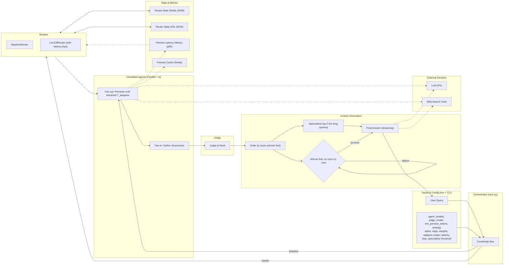
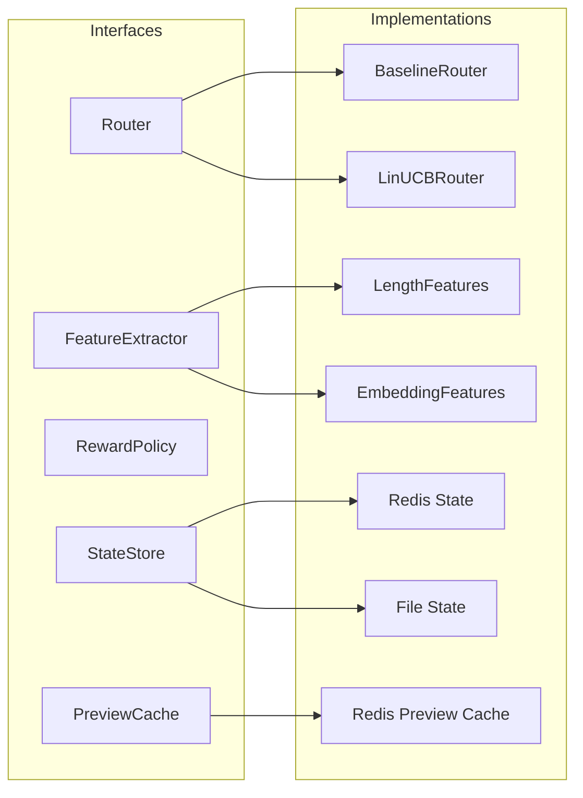
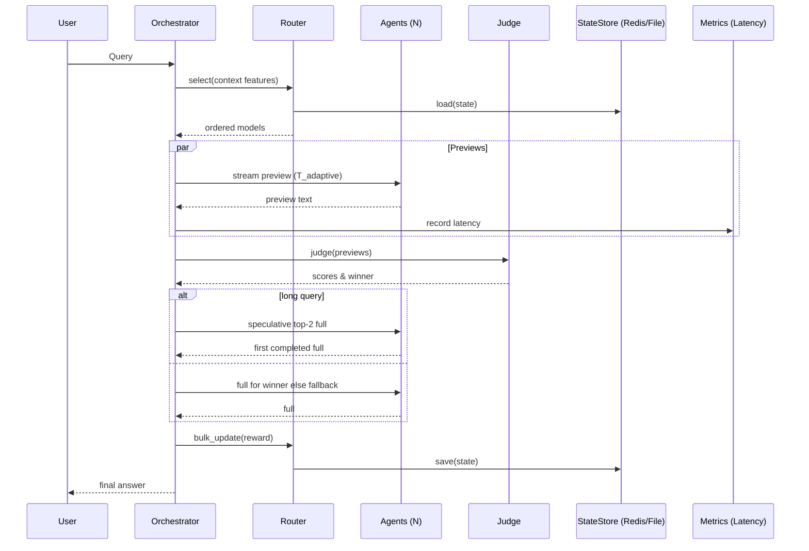
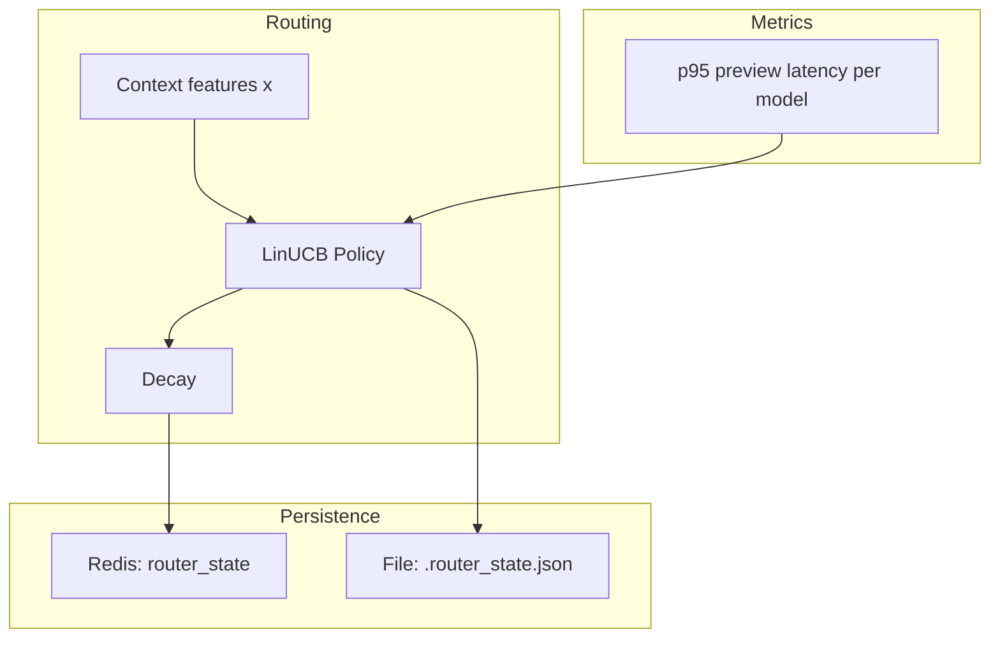

## Parallel AI Research System — Architecture

A competitive multi-agent system that races multiple frontier models (e.g., gpt-5, o4-mini-deep-research, gpt-4o) in parallel to deliver faster, more reliable research results.

### Quickstart (Setup + Run)

1) Install prerequisites

- Python 3.10+
- uv (Python package manager). If needed: `pip install uv`

2) Sync dependencies

```bash
cd parallel_agents
uv sync
```

3) Configure API keys via .env

Create a file named `.env` in this folder with at least your OpenAI key:

```bash
cat > .env << 'EOF'
OPENAI_API_KEY=sk-your-openai-key
# Optional if using a custom endpoint (e.g., Azure/OpenAI-compatible gateway):
# OPENAI_BASE_URL=https://api.openai.com/v1
# OPENAI_ORG_ID=your-org-id
EOF
```

The CLI automatically loads `.env` (via `python-dotenv`).

4) See CLI usage

```bash
uv run parallel-agents --help
```

5) Minimal run

```bash
uv run parallel-agents "What are the key risks and mitigations of LLM hallucinations in production?" \
  --judge-model gpt-4o \
  --agent-models "gpt-4o,gpt-4o-mini" \
  --strategy bandit
```

#### Verify (Tier 1) — default command

After implementing Tier 1, use this command to verify lint, format, and tests:

```bash
cd parallel_agents && uv sync && \
uv run ruff check . && uv run ruff format --check . && uv run pytest -q
```

6) Full bandit example

```bash
uv run parallel-agents "Summarize the latest evidence for outpatient UTI management in CA-ON." \
  --judge-model gpt-4o \
  --agent-models "o4-mini-deep-research-2025-06-26,gpt-4o,gpt-4o-mini,gpt-5,gpt-4.1" \
  --min-preview-tokens 200 \
  --strategy bandit \
  --bandit-alpha 1.5 \
  --bandit-ridge 1e-2 \
  --bandit-state .router_state.json \
  --bandit-length-threshold 2000 \
  --bandit-quality-weight 0.8 \
  --bandit-speed-weight 0.2
```

Notes:
- An entry point is installed as `parallel-agents` (via `pyproject.toml`). You can also run `uv run python -m src.cli ...`.
- Router state persistence:
  - If `REDIS_URL` is set, router state persists in Redis under `ROUTER_STATE_KEY` (default: `router_state`).
  - If `--bandit-state` points to a file, JSON persistence is also used (for portability). Delete it to reset local learning.

### Optional: Redis preview cache

You can enable a lightweight Redis cache for preview responses to reduce cost and latency on repeat queries.

1) Run Redis locally (or use a managed instance):

```bash
brew install redis
brew services start redis
# or docker run -p 6379:6379 redis:7
```

2) Add the following to your `.env`:

```bash
REDIS_URL=redis://localhost:6379/0
# Optional TTL (seconds) for preview cache entries (default: 600)
PREVIEW_CACHE_TTL=600
```

When `REDIS_URL` is set, the orchestrator will:
- Attempt to read previews from Redis before calling models
- Write preview results into Redis with a TTL after generation
- Fall back to direct generation if the cache is disabled or a miss occurs

Implementation: see `src/services/cache_redis.py` and usage in `src/race/race.py`.

### System Architecture



### Interfaces & Components (Tier 0)



### End-to-End Sequence (with Bandit + Judge)



### State & Metrics



### Configuration (env + CLI)

- Core env: `OPENAI_API_KEY`, `REDIS_URL`, `ROUTER_STATE_KEY`
- Bandit env defaults: `BANDIT_ALPHA`, `BANDIT_RIDGE`, `BANDIT_STATE`, `BANDIT_LENGTH_THRESHOLD`, `BANDIT_QUALITY_WEIGHT`, `BANDIT_SPEED_WEIGHT`, `BANDIT_FALLBACK_PENALTY`, `LATENCY_BIAS_SCALE`, `ADAPTIVE_MIN_SCALE`, `ADAPTIVE_MAX_SCALE`, `SPECULATIVE_MIN_QUERY_LENGTH`
- Preview cache: `PREVIEW_CACHE_TTL`

### Why bandit routing (with a judge already in place)

- **Roles are different**:
  - **Judge on previews**: scores all candidates’ previews and determines the best content plan (quality selection). This protects final answer quality regardless of order.
  - **Bandit router**: chooses the order to attempt full generations so we hit the likely winner first (efficiency selection). This cuts retries and tail latency.

- **What bandit guarantees (intuitively)**:
  - Compared to any fixed order, LinUCB’s UCB policy increases the probability that the first attempted model is the same one the judge would ultimately prefer for similar queries (higher first-try success).
  - With continued traffic, uncertainty shrinks and the policy converges to context-specific best ordering; cumulative regret grows sublinearly. In practice this means fewer fallbacks over time.
  - Final quality is not degraded: if the first attempt fails or underperforms, the fallback cascade still tries the next best according to the judge.

- **Why it’s needed even with judging**:
  - The judge only tells us which candidate is best after seeing all previews. We still must choose which model to run first for the full answer. Without bandit learning, that choice is arbitrary or static.
  - Learning the mapping from simple context features (e.g., length) to “which model tends to win judging and succeed” reduces expected retries, lowering E2E p95/p99 and cost.

- **Measurable effects (what to track)**:
  - First-try success rate ↑; retries per run ↓; E2E p95/p99 ↓; tokens per run ↓; $/resolved ↓.
  - Exploration rate ↓ over time as state accumulates; traffic adapts to provider drift.

Details and instrumentation:
- **LinUCB scoring (supports "better first choice")**
  - Posterior per arm: $\hat{\theta} = A^{-1} b$, with $A = \lambda I + \sum x x^\top$, $b = \sum r x$.
  - Upper Confidence Bound:
    
  $$\mathrm{UCB}(x) = \hat{\theta}^\top x + \alpha \, \sqrt{x^\top A^{-1} x}$$
    
  - Ordering by UCB increases $\Pr(\text{first pick} = \text{oracle-best})$. In offline sim, routing accuracy $\approx 1.0$ vs $0.5$ chance.
  - Instrument: log context features $x$, chosen arm, mean $= \hat{\theta}^\top x$, uncertainty $= \sqrt{x^\top A^{-1} x}$, and first-try success.
- **Lower tail latency via fewer fallbacks**
  - Let $T_{\mathrm{E2E}} = T_{\mathrm{previews}} + T_{\mathrm{judge}} + T_{\mathrm{full}}$. With fallbacks:

  $$\mathbb{E}[T_{\mathrm{E2E}}] \approx T_{\mathrm{previews}} + T_{\mathrm{judge}} + \sum_{i=1}^{K} p_i \cdot T^{(i)}_{\mathrm{retry}} + T^{(\star)}_{\mathrm{full}}$$

  - Higher first-try success lowers $\sum_i p_i$, shrinking mean and p95/p99 (per Tail at Scale).
  - Instrument: fallbacks per run, E2E p50/p95/p99, and retry time.
- **Lower cost via reduced retries + bounded exploration**
  - Expected tokens:
    
  $$\mathbb{E}[C] = C_{\mathrm{previews}} + C_{\mathrm{full}} + \sum_i p_i \cdot C^{(i)}_{\mathrm{retry}}$$
    
  - Higher first-try success decreases $\sum_i p_i \cdot C^{(i)}_{\mathrm{retry}}$. $\alpha$ and $\lambda$ bound exploration; as data grows, $A^{-1}$ shrinks, reducing uncertainty.
  - Persistence of $(A^{-1}, b)$ across runs compounds learning and reduces cold-start waste.
  - Instrument: tokens per phase, retries’ token cost, and $/resolved by strategy (baseline vs bandit).
- **Drift resilience**
  - Online updates adjust $\hat{\theta}$ as provider quality/latency changes; add decay (scale $A^{-1}$, $b$) or a sliding window for faster adaptation.
  - Include health in features $x$: recent success rate, p95 latency, error budget burn, guardrail risk.
  - Instrument: regret vs oracle (offline), routing share over time, correlation with provider health.

> When bandit helps most: model quality/latency varies materially by query characteristics (length/intent/risk), and provider health drifts over time. When it won’t: homogeneous models with identical performance across contexts — in that case bandit converges to baseline routing with minimal overhead.

### What are bandits?
- **Multi-armed bandits (MAB)**: sequential decisions balancing exploration vs exploitation. At round $t$, pick arm $a_t$, observe reward $r_t \in [0,1]$, aim to minimize cumulative regret:
  
  $$ R_T = \sum_{t=1}^{T} \big(\mu^* - \mu_{a_t}\big) $$
  
  where $\mu^*$ is the best arm’s expected reward.
- **Contextual bandits**: each round comes with features $x_t$. Arm rewards depend on context: $\mu_a(x_t)$. The goal is to learn a routing policy $\pi(x)$ that picks the best arm for each context.
- **LinUCB**:
  - Assumption: linear reward model per arm: $\mathbb{E}[r|x,a] = \theta_a^\top x$.
  - Maintain per-arm $A^{-1}$ (inverse covariance) and $b$ (response). Estimate $\hat{\theta}_a = A^{-1} b$.
  - Score arms by UCB (above). Pick argmax, observe reward, update:
    - $A^{-1} \leftarrow$ Sherman–Morrison update with $x x^\top$
    - $b \leftarrow b + r\,x$
  - Intuition: pick arms with high predicted reward or high uncertainty; uncertainty shrinks as evidence accumulates.

#### Configuration knobs (make the trade-offs explicit)
- **--strategy**: `baseline | bandit`
- **--bandit-alpha**: exploration strength $\alpha$ (higher = more exploration)
- **--bandit-ridge**: regularization $\lambda$ (stability; larger reduces variance)
- **--bandit-state**: JSON path to persist $(A^{-1}, b)$ across runs
- **--bandit-length-threshold**: normalizer for length feature (default 2000); set to your median query chars or compute tokens
- **--bandit-quality-weight --bandit-speed-weight**: reward weights; must sum to $\le 1$ for clipping to [0,1]

#### Validation checklist (baseline vs bandit)
1. Define a prompt set (≥100) across intents/lengths; run both strategies.
2. Log: first-try success, fallbacks, E2E p50/p95/p99, tokens per phase, $/resolved.
3. Compare: bandit should improve first-try success and reduce fallbacks, lowering p95/p99 and cost.
4. Sanity: ensure exploration rate decreases over time; investigate anomalies in provider health.

References: “The Tail at Scale” (Dean & Barroso, 2013); contextual bandits/LinUCB tutorials (e.g., Russo et al.).

#### Observed metrics (local simulation and live run)

| Scenario | Routing Accuracy vs Oracle | Winner Fallbacks | Notes |
| --- | ---:| ---:| --- |
| Offline sim (smoke_bandit) | ~1.00 | n/a | Distinct arms by feature; materially > 0.5 chance |
| Live quick trial (France capital) | Judge winner on first try | 0 | Both models passed preview; judge picked the higher overall |


> Tip: Track p95 E2E latency, retries per run, and $/resolved request with and without `--strategy bandit`. Persist state via `--bandit-state` to accumulate learning.


### Key Design Decisions

- Parallel Racing: Multiple LLMs compete simultaneously to reduce latency
- Quality-Based Selection: LLM-as-a-judge evaluates all previews and selects the best approach
- Fault Tolerance: Automatic fallback cascade when preferred models fail
- Real-time Streaming: Token-by-token delivery for responsive user experience
- Cost Optimization: Preview phase uses minimal tokens; only winner generates full response

### Integration & Usage

- Run with uv (project root is this folder):
```bash
uv run python -m src.cli "Generate a comprehensive, provider-ready UTI assessment and plan for Sarah Smith, a 28-year-old non-pregnant female in region CA-ON with normal renal function. Presenting symptoms: dysuria and urgency. Denies: frequency, suprapubic pain, hematuria. No red flags: fever, rigors, flank pain, nausea/vomiting, systemic illness. History: no antibiotics in last 90 days; no allergies; no current meds; no ACEI/ARB use; no indwelling catheter; no urinary stones; not immunocompromised. Recurrence markers: none (no relapse within 4 weeks; not recurrent at 6 or 12 months).

Return a single markdown document with these sections:
- Executive Summary
- Deterministic Assessment (algorithm decision, rationale)
- Treatment Recommendation (regimen, dose, frequency, duration; acceptable alternatives; contraindications)
- Safety Validation (DDIs, renal/pregnancy considerations; approval/modify/reject with rationale; monitoring)
- Clinical Reasoning Narrative (differential diagnosis and confidence score)
- Prescribing Considerations tailored to CA-ON (include regional resistance context)
- Research Summary with citations (concise, credible sources)
- 72-Hour Follow-Up Plan (monitoring checklist, special instructions)
- Diagnosis Brief (provider-ready narrative)

Use current evidence-based guidelines, tailor recommendations to patient factors and regional resistance, and keep each section concise and actionable." \
  --judge-model gpt-4o \
  --agent-models "o4-mini-deep-research-2025-06-26,gpt-4o,gpt-4o-mini,gpt-5,gpt-4.1" \
  --min-preview-tokens 200 \
  --strategy bandit \
  --bandit-alpha 1.5 \
  --bandit-ridge 1e-2 \
  --bandit-state .router_state.json \
  --bandit-length-threshold 2000 \
  --bandit-quality-weight 0.8 \
  --bandit-speed-weight 0.2
```

#### Why bandit routing?
- Prioritizes high-value models first, reducing retries and tail latency.
- Learns per-intent and length which model wins judged comparisons, lowering cost.
- Adapts to provider drift and incidents by shifting traffic, while preserving exploration.

#### Implementation notes
- LinUCB with Sherman–Morrison updates and JSON persistence in `src/routing/routing_linucb.py`.
- Unified orchestrator: `src/race/race.py` with `--strategy baseline|bandit` switch.
- CLI flag `--strategy baseline|bandit` to switch without code changes.
