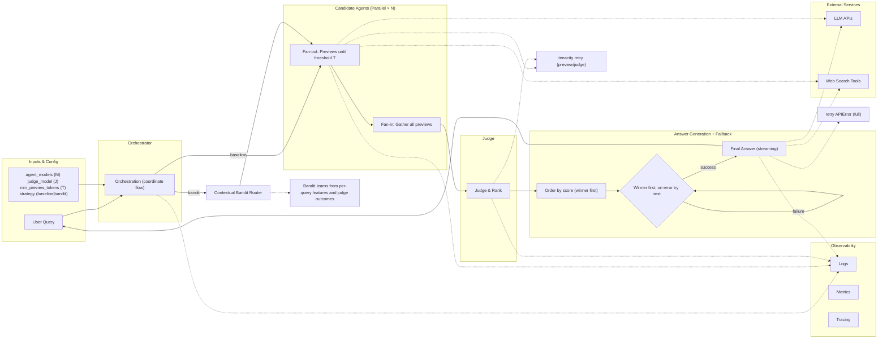

## Parallel AI Research System — Architecture

A competitive multi-agent system that races multiple frontier models (e.g., gpt-5, o4-mini-deep-research, gpt-4o) in parallel to deliver faster, more reliable research results.

### Quickstart (Setup + Run)

1) Install prerequisites

- Python 3.10+
- uv (Python package manager). If needed: `pip install uv`

2) Sync dependencies

```bash
cd parallel_agents
uv sync
```

3) Configure API keys via .env

Create a file named `.env` in this folder with at least your OpenAI key:

```bash
cat > .env << 'EOF'
OPENAI_API_KEY=sk-your-openai-key
# Optional if using a custom endpoint (e.g., Azure/OpenAI-compatible gateway):
# OPENAI_BASE_URL=https://api.openai.com/v1
# OPENAI_ORG_ID=your-org-id
EOF
```

The CLI automatically loads `.env` (via `python-dotenv`).

4) See CLI usage

```bash
uv run parallel-agents --help
```

Key arguments:
- `query` (positional): the research question/prompt
- `--judge-model`: model ID for the judge (required)
- `--agent-models`: comma-separated candidate model IDs (required)
- `--min-preview-tokens`: minimum preview tokens per candidate (default 120)
- `--strategy`: `baseline` or `bandit` (default `baseline`)

5) Minimal run

```bash
uv run parallel-agents "What are the key risks and mitigations of LLM hallucinations in production?" \
  --judge-model gpt-4o \
  --agent-models "gpt-4o,gpt-4o-mini" \
  --strategy bandit \
  --wandb
```

6) Full bandit example

```bash
uv run parallel-agents "Summarize the latest evidence for outpatient UTI management in CA-ON." \
  --judge-model gpt-4o \
  --agent-models "o4-mini-deep-research-2025-06-26,gpt-4o,gpt-4o-mini,gpt-5,gpt-4.1" \
  --min-preview-tokens 200 \
  --strategy bandit \
  --bandit-alpha 1.5 \
  --bandit-ridge 1e-2 \
  --bandit-state .router_state.json \
  --bandit-length-threshold 2000 \
  --bandit-quality-weight 0.8 \
  --bandit-speed-weight 0.2
```

Notes:
- An entry point is installed as `parallel-agents` (via `pyproject.toml`). You can also run `uv run python -m src.cli ...`.
- Bandit state persists to `.router_state.json` by default; delete it to reset learning.

### System Architecture



### How bandit improves the parallel race

- **Better first choice**: Instead of sending previews in static order, LinUCB ranks models by expected reward for the current query (features like normalized length, later extendable to intent/safety/health).
- **Lower tail latency**: Winner is more likely to produce the final answer, reducing fallback attempts and end-to-end p95/p99.
- **Lower cost**: Fewer retries; exploration is bounded via alpha and ridge regularization, with learned state persisted across runs.
- **Drift resilience**: As providers degrade/improve, updates shift traffic automatically.

Details and instrumentation:
- **LinUCB scoring (supports "better first choice")**
  - Posterior per arm: $\hat{\theta} = A^{-1} b$, with $A = \lambda I + \sum x x^\top$, $b = \sum r x$.
  - Upper Confidence Bound:
    
  $$\mathrm{UCB}(x) = \hat{\theta}^\top x + \alpha \, \sqrt{x^\top A^{-1} x}$$
    
  - Ordering by UCB increases $\Pr(\text{first pick} = \text{oracle-best})$. In offline sim, routing accuracy $\approx 1.0$ vs $0.5$ chance.
  - Instrument: log $x$, chosen arm, mean $= \hat{\theta}^\top x$, uncertainty $= \sqrt{x^\top A^{-1} x}$, and first-try success.
- **Lower tail latency via fewer fallbacks**
  - Let $T_{\mathrm{E2E}} = T_{\mathrm{previews}} + T_{\mathrm{judge}} + T_{\mathrm{full}}$. With fallbacks:

  $$\mathbb{E}[T_{\mathrm{E2E}}] \approx T_{\mathrm{previews}} + T_{\mathrm{judge}} + \sum_{i=1}^{K} p_i \cdot T^{(i)}_{\mathrm{retry}} + T^{(\star)}_{\mathrm{full}}$$

  - Higher first-try success lowers $\sum_i p_i$, shrinking mean and p95/p99 (per Tail at Scale).
  - Instrument: fallbacks per run, E2E p50/p95/p99, and retry time.
- **Lower cost via reduced retries + bounded exploration**
  - Expected tokens:
    
  $$\mathbb{E}[C] = C_{\mathrm{previews}} + C_{\mathrm{full}} + \sum_i p_i \cdot C^{(i)}_{\mathrm{retry}}$$
    
  - Higher first-try success decreases $\sum_i p_i \cdot C^{(i)}_{\mathrm{retry}}$. $\alpha$ and $\lambda$ bound exploration; as data grows, $A^{-1}$ shrinks, reducing uncertainty.
  - Persistence of $(A^{-1}, b)$ across runs compounds learning and reduces cold-start waste.
  - Instrument: tokens per phase, retries’ token cost, and $/resolved by strategy (baseline vs bandit).
- **Drift resilience**
  - Online updates adjust $\hat{\theta}$ as provider quality/latency changes; add decay (scale $A^{-1}$, $b$) or a sliding window for faster adaptation.
  - Include health in features $x$: recent success rate, p95 latency, error budget burn, guardrail risk.
  - Instrument: regret vs oracle (offline), routing share over time, correlation with provider health.

> When bandit helps most: model quality/latency varies materially by query characteristics (length/intent/risk), and provider health drifts over time. When it won’t: homogeneous models with identical performance across contexts — in that case bandit converges to baseline routing with minimal overhead.

### What are bandits?
- **Multi-armed bandits (MAB)**: sequential decisions balancing exploration vs exploitation. At round $t$, pick arm $a_t$, observe reward $r_t \in [0,1]$, aim to minimize cumulative regret:
  
  $$ R_T = \sum_{t=1}^{T} \big(\mu^* - \mu_{a_t}\big) $$
  
  where $\mu^*$ is the best arm’s expected reward.
- **Contextual bandits**: each round comes with features $x_t$. Arm rewards depend on context: $\mu_a(x_t)$. The goal is to learn a routing policy $\pi(x)$ that picks the best arm for each context.
- **LinUCB**:
  - Assumption: linear reward model per arm: $\mathbb{E}[r|x,a] = \theta_a^\top x$.
  - Maintain per-arm $A^{-1}$ (inverse covariance) and $b$ (response). Estimate $\hat{\theta}_a = A^{-1} b$.
  - Score arms by UCB (above). Pick argmax, observe reward, update:
    - $A^{-1} \leftarrow$ Sherman–Morrison update with $x x^\top$
    - $b \leftarrow b + r\,x$
  - Intuition: pick arms with high predicted reward or high uncertainty; uncertainty shrinks as evidence accumulates.

#### Configuration knobs (make the trade-offs explicit)
- **--strategy**: `baseline | bandit`
- **--bandit-alpha**: exploration strength $\alpha$ (higher = more exploration)
- **--bandit-ridge**: regularization $\lambda$ (stability; larger reduces variance)
- **--bandit-state**: JSON path to persist $(A^{-1}, b)$ across runs
- **--bandit-length-threshold**: normalizer for length feature (default 2000); set to your median query chars or compute tokens
- **--bandit-quality-weight --bandit-speed-weight**: reward weights; must sum to $\le 1$ for clipping to [0,1]

#### Validation checklist (baseline vs bandit)
1. Define a prompt set (≥100) across intents/lengths; run both strategies.
2. Log: first-try success, fallbacks, E2E p50/p95/p99, tokens per phase, $/resolved.
3. Compare: bandit should improve first-try success and reduce fallbacks, lowering p95/p99 and cost.
4. Sanity: ensure exploration rate decreases over time; investigate anomalies in provider health.

References: “The Tail at Scale” (Dean & Barroso, 2013); contextual bandits/LinUCB tutorials (e.g., Russo et al.).

#### Observed metrics (local simulation and live run)

| Scenario | Routing Accuracy vs Oracle | Winner Fallbacks | Notes |
| --- | ---:| ---:| --- |
| Offline sim (smoke_bandit) | ~1.00 | n/a | Distinct arms by feature; materially > 0.5 chance |
| Live quick trial (France capital) | Judge winner on first try | 0 | Both models passed preview; judge picked the higher overall |


> Tip: Track p95 E2E latency, retries per run, and $/resolved request with and without `--strategy bandit`. Persist state via `--bandit-state` to accumulate learning.


### Key Design Decisions

- Parallel Racing: Multiple LLMs compete simultaneously to reduce latency
- Quality-Based Selection: LLM-as-a-judge evaluates all previews and selects the best approach
- Fault Tolerance: Automatic fallback cascade when preferred models fail
- Real-time Streaming: Token-by-token delivery for responsive user experience
- Cost Optimization: Preview phase uses minimal tokens; only winner generates full response

### Integration & Usage

- Run with uv (project root is this folder):
```bash
uv run python -m src.cli "Generate a comprehensive, provider-ready UTI assessment and plan for Sarah Smith, a 28-year-old non-pregnant female in region CA-ON with normal renal function. Presenting symptoms: dysuria and urgency. Denies: frequency, suprapubic pain, hematuria. No red flags: fever, rigors, flank pain, nausea/vomiting, systemic illness. History: no antibiotics in last 90 days; no allergies; no current meds; no ACEI/ARB use; no indwelling catheter; no urinary stones; not immunocompromised. Recurrence markers: none (no relapse within 4 weeks; not recurrent at 6 or 12 months).

Return a single markdown document with these sections:
- Executive Summary
- Deterministic Assessment (algorithm decision, rationale)
- Treatment Recommendation (regimen, dose, frequency, duration; acceptable alternatives; contraindications)
- Safety Validation (DDIs, renal/pregnancy considerations; approval/modify/reject with rationale; monitoring)
- Clinical Reasoning Narrative (differential diagnosis and confidence score)
- Prescribing Considerations tailored to CA-ON (include regional resistance context)
- Research Summary with citations (concise, credible sources)
- 72-Hour Follow-Up Plan (monitoring checklist, special instructions)
- Diagnosis Brief (provider-ready narrative)

Use current evidence-based guidelines, tailor recommendations to patient factors and regional resistance, and keep each section concise and actionable." \
  --judge-model gpt-4o \
  --agent-models "o4-mini-deep-research-2025-06-26,gpt-4o,gpt-4o-mini,gpt-5,gpt-4.1" \
  --min-preview-tokens 200 \
  --strategy bandit \
  --bandit-alpha 1.5 \
  --bandit-ridge 1e-2 \
  --bandit-state .router_state.json \
  --bandit-length-threshold 2000 \
  --bandit-quality-weight 0.8 \
  --bandit-speed-weight 0.2
```

#### Why bandit routing?
- Prioritizes high-value models first, reducing retries and tail latency.
- Learns per-intent and length which model wins judged comparisons, lowering cost.
- Adapts to provider drift and incidents by shifting traffic, while preserving exploration.

#### Implementation notes
- LinUCB with Sherman–Morrison updates and JSON persistence in `src/routing_linucb.py`.
- Unified orchestrator: `src/race.py` with `--strategy baseline|bandit` switch.
- CLI flag `--strategy baseline|bandit` to switch without code changes.
