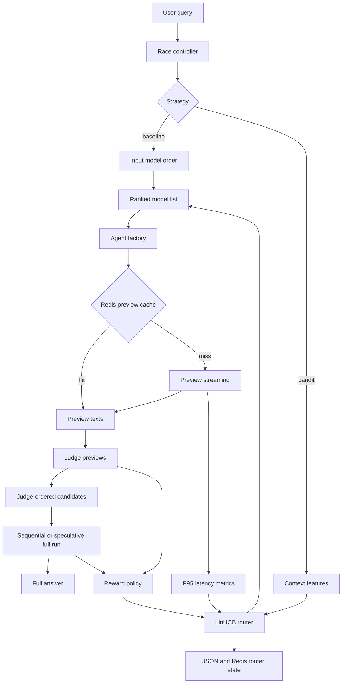
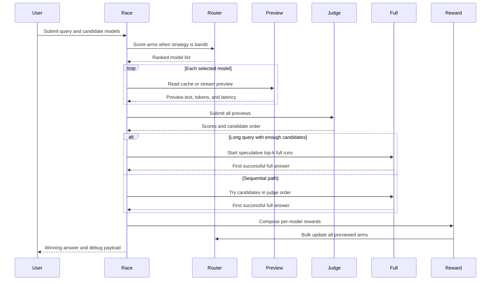
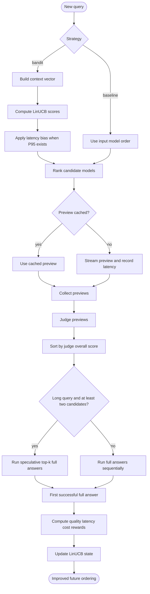

## Parallel AI Research System

A multi-candidate research runner that ranks frontier models, judges short previews, and streams the full answer from the best available candidate. With `--strategy bandit`, the runtime uses a contextual LinUCB router to learn model ordering from judge quality, latency, and optional cost signals.

## What Is Implemented

- `baseline`: keep the input model order.
- `bandit`: rank the candidate model list with LinUCB before previewing.
- The router currently ranks all candidate models passed through `--agent-models`; it does not prune the pool by itself.
- Preview generation is executed per selected model with optional Redis cache reads.
- Full-answer generation is sequential by judge order, except long queries can use speculative top-k full runs in parallel.
- Thompson sampling and epsilon-greedy are not runtime strategies here; they only appear in roadmap material.

## Why Bandit Routing?

Static routing treats the candidate order as fixed. LinUCB learns which models tend to perform well for a query context, while still exploring uncertain arms. In this codebase, the learned ordering is used before preview generation and is updated after the judge and full-answer stages produce feedback.

Key benefits:

- Adaptive ordering: learns from historical outcomes.
- Multi-objective feedback: blends judge quality, latency, and optional cost.
- Uncertainty-aware exploration: adds a confidence term to each arm score.
- Persistent learning: stores router state in JSON and, when configured, Redis.

## System Architecture


```mermaid
flowchart TB
  query["User query"] --> race["Race controller"]
  race --> strategy{"Strategy"}

  strategy -->|baseline| inputOrder["Input model order"]
  strategy -->|bandit| features["Context features"]
  features --> router["LinUCB router"]
  metrics["P95 latency metrics"] --> router
  router --> ranked["Ranked model list"]
  inputOrder --> ranked

  ranked --> factory["Agent factory"]
  factory --> cache{"Redis preview cache"}
  cache -->|hit| previews["Preview texts"]
  cache -->|miss| previewStream["Preview streaming"]
  previewStream --> previews
  previewStream --> metrics

  previews --> judge["Judge previews"]
  judge --> order["Judge-ordered candidates"]
  order --> full["Sequential or speculative full run"]
  full --> answer["Full answer"]

  judge --> reward["Reward policy"]
  full --> reward
  reward --> router
  router --> state["JSON and Redis router state"]
```

## Bandit Routing Flow


```mermaid
sequenceDiagram
  participant User
  participant Race
  participant Router
  participant Preview
  participant Judge
  participant Full
  participant Reward

  User->>Race: Submit query and candidate models
  Race->>Router: Score arms when strategy is bandit
  Router-->>Race: Ranked model list

  loop Each selected model
    Race->>Preview: Read cache or stream preview
    Preview-->>Race: Preview text, tokens, and latency
  end

  Race->>Judge: Submit all previews
  Judge-->>Race: Scores and candidate order

  alt Long query with enough candidates
    Race->>Full: Start speculative top-k full runs
    Full-->>Race: First successful full answer
  else Sequential path
    Race->>Full: Try candidates in judge order
    Full-->>Race: First successful full answer
  end

  Race->>Reward: Compose per-model rewards
  Reward->>Router: Bulk update all previewed arms
  Race-->>User: Winning answer and debug payload
```

## Decision Process


```mermaid
flowchart TD
  start([New query]) --> strategy{"Strategy"}
  strategy -->|baseline| baseline["Use input model order"]
  strategy -->|bandit| featureNode["Build context vector"]
  featureNode --> score["Compute LinUCB scores"]
  score --> bias["Apply latency bias when P95 exists"]
  bias --> ranked["Rank candidate models"]
  baseline --> ranked

  ranked --> cacheCheck{"Preview cached?"}
  cacheCheck -->|yes| cached["Use cached preview"]
  cacheCheck -->|no| stream["Stream preview and record latency"]
  cached --> collect["Collect previews"]
  stream --> collect

  collect --> judge["Judge previews"]
  judge --> ordered["Sort by judge overall score"]
  ordered --> longQuery{"Long query and at least two candidates?"}
  longQuery -->|yes| spec["Run speculative top-k full answers"]
  longQuery -->|no| sequential["Run full answers sequentially"]
  spec --> result["First successful full answer"]
  sequential --> result

  result --> rewards["Compute quality latency cost rewards"]
  rewards --> update["Update LinUCB state"]
  update --> done([Improved future ordering])
```

## Inputs and Outputs

### User and CLI Inputs

| Input | Where it enters | Used for |
| --- | --- | --- |
| `query` | Positional CLI argument | Preview prompts, full-answer prompt, feature extraction, latency normalization, reward computation |
| `--agent-models` | Comma-separated model list | Candidate arms for baseline or bandit ordering |
| `--judge-model` | CLI flag | Model that scores preview quality |
| `--strategy` | `baseline` or `bandit` | Chooses input order or learned LinUCB order |
| `--min-preview-tokens` | CLI flag | Base preview token target before adaptive scaling |
| `--bandit-length-threshold` | CLI flag / env | Normalizes query length in features and latency reward |
| `--bandit-features` | `length` or `embedding` | Chooses length-only or length-plus-embedding context vector |
| `--bandit-alpha` | CLI flag / env | LinUCB exploration strength |
| `--bandit-ridge` | CLI flag / env | Ridge regularization for new arms |
| Reward weights | `--bandit-quality-weight`, `--bandit-speed-weight`, `--bandit-cost-weight` | Blend judge quality, latency, and cost into rewards |

### Bandit Context Features

The default router input vector is length-only:

| Position | Feature | Formula | Source |
| --- | --- | --- | --- |
| $x_0$ | Bias term | $1$ | Constant |
| $x_1$ | Query length ratio | $\min\left(1, \frac{\lvert q\rvert}{\tau_+}\right)$ | `LengthFeatures.compute` |
| $x_2$ | Query word-count ratio | $\min\left(1, \frac{\operatorname{words}(q)}{100}\right)$ | `LengthFeatures.compute` |

When `BANDIT_FEATURES=embedding`, the runtime appends an embedding projection:

| Added features | Mathematical form | Source |
| --- | --- | --- |
| $x_{3:}$ | $z = \operatorname{standardize}(P e(q))$, where $e(q)$ is the OpenAI embedding and $P \in \mathbb{R}^{m \times 1536}$ with $m=\max(8,d_{\mathrm{emb}})$ | `EmbeddingFeatures.compute` |

Important exclusions:

- `compute_intent_signals(...)` exists in `src/features.py`, but it is not wired into `compute_context_features(...)`.
- Per-model latency is not part of $x$; it is added later as an arm-specific score bias.
- Cost is not part of $x$; it is only used in the reward update when `MODEL_PRICE_USD_PER_TOKEN_JSON` provides prices or through the token-count fallback.

### Router Outputs

| Output | Type | Meaning |
| --- | --- | --- |
| `selected_models` | `list[str]` | Candidate models ordered by baseline input order or descending LinUCB score |
| Router state | JSON file and/or Redis payload | Per-arm $A_a^{-1}$ and $b_a$ values, stored as `A_inv` and `b`, used for future ranking |
| Preview latency metrics | `.router_metrics.json` by default | Per-model latency samples used for P95 latency bias and latency reward |

The router does not currently remove candidates. In bandit mode it ranks every
model passed through `--agent-models`, and the preview stage still evaluates all
ranked candidates.

### Run Outputs

`race_with_judge_and_stream(...)` returns:

| Return value | Meaning |
| --- | --- |
| `winner_idx` | Zero-based index of the selected full-answer candidate in the current ranked model list |
| `winner_agent` | Full agent name used for the winning answer |
| `debug` | Dictionary with previews, tokens, latencies, judge scores, selected model order, final response, citations, and fallback failures |

The CLI writes the full response to `logs/response_<timestamp>.md` and logs a JSON summary with:

| Field | Meaning |
| --- | --- |
| `winner_index`, `winner_agent` | Winning candidate metadata |
| `judge_scores` | Per-candidate judge scores |
| `agent_models` | Actual selected model order for this run |
| `preview_tokens`, `full_response_tokens` | Token counts captured by the streaming layer |
| `full_response_saved_to` | Path to the saved Markdown response |
| `citations` | Citations extracted from previews and the full answer |

### Reward Update Inputs

The bandit update happens after the full answer succeeds:

| Reward input | Source | Effect |
| --- | --- | --- |
| `judge_overall` | Judge verdict scores | Quality term $Q_a$ |
| Preview P95 latency | `.router_metrics.json` | Latency term $L_a$ |
| Preview token counts | Preview streaming output | Cost/token-efficiency term $C_a$ |
| Failed full-answer indices | Sequential/speculative fallback path | Applies `fallback_penalty` to failed candidates |

## Algorithm Details

### Local Markdown Preview

This README keeps formulas as LaTeX source so it stays compatible with GitHub
Markdown. For local preview, use VS Code's built-in Markdown preview rather than
a replacement renderer. The built-in preview supports KaTeX math blocks and
Mermaid diagrams, and it stays closest to the system Markdown behavior.

If the default preview looks too plain, customize the built-in preview with
`markdown.styles` or a Markdown preview style extension instead of switching to a
different Markdown renderer.

### Contextual Bandit Used

The runtime learning strategy is LinUCB, implemented in `src/routing/routing_linucb.py`. For each model arm `a`, the router stores an inverse design matrix `A_inv_a` and response vector `b_a`.

Notation:

| Symbol | Meaning | Code name |
| --- | --- | --- |
| $a$ | Candidate model arm | One entry from `agent_models` |
| $x$ | Context feature vector for the query | `feats` |
| $A_a^{-1}$ | Inverse design matrix for arm $a$ | `A_inv` |
| $b_a$ | Response vector for arm $a$ | `b` |
| $\lambda$ | Ridge regularization strength | `bandit_ridge_lambda` |
| $\alpha$ | Exploration strength | `bandit_alpha` |
| $\beta$ | Latency-bias scale | `latency_bias_scale` |
| $\rho$ | Full-answer fallback penalty | `fallback_penalty` |
| $\tau$ | Query-length normalization threshold | `length_threshold` |
| $T$ | Adaptive preview token target | `adaptive_min_tokens` |

Initialization:

$$
\begin{aligned}
\lambda_+ &= \max(10^{-9}, \lambda) \\
A_a^{-1} &= \frac{1}{\lambda_+} I_d,\qquad b_a = \mathbf{0}_d
\end{aligned}
$$

In code, `A_a^{-1}` is stored as `A_inv_a`.

Scoring:

$$
\begin{aligned}
\hat{\theta}_a &= A_a^{-1} b_a \\
\mu_a(x) &= \hat{\theta}_a^\top x \\
\sigma_a(x) &= \sqrt{\max(0, x^\top A_a^{-1} x)} \\
\operatorname{bias}_a(x) &=
\begin{cases}
-\beta\ell_a(x), & \text{if P95 latency exists for arm } a \\
0, & \text{otherwise}
\end{cases} \\
s_a(x) &= \mu_a(x) + \alpha\sigma_a(x) + \operatorname{bias}_a(x)
\end{aligned}
$$

Notes:

- The bias term is zero when no P95 latency has been recorded for the model.
- $\beta$ is `latency_bias_scale`.
- $\ell_a(x)$ is the normalized P95 latency term.
- $\alpha$ controls exploration strength. The default is $1.5$.
- $\lambda$ is the ridge regularization value. The default is $10^{-2}$.
- The selected list is sorted by descending score.

Update after rewards:

$$
\begin{aligned}
v_a &= A_a^{-1}x \\
d_a &= \max(10^{-9}, 1 + x^\top v_a) \\
A_a^{-1} &\leftarrow A_a^{-1} - \frac{v_a v_a^\top}{d_a} \\
b_a &\leftarrow b_a + r_a x
\end{aligned}
$$

This is the Sherman-Morrison update for $(A_a + xx^\top)^{-1}$, with $A_a$ conceptually initialized as $\lambda_+ I_d$.

### Feature Vector

The default context vector comes from `compute_context_features(...)` with length features enabled:

$$
\begin{aligned}
\tau_+ &= \max(1, \tau) \\
x &=
\begin{bmatrix}
1 \\
\min\left(1, \frac{|q|}{\tau_+}\right) \\
\min\left(1, \frac{\operatorname{words}(q)}{100}\right)
\end{bmatrix}
\end{aligned}
$$

Here $q$ is the query and $\tau$ is `length_threshold`.

When `BANDIT_FEATURES=embedding`, the runtime appends a fixed-random-projection embedding vector from `text-embedding-3-small` by default. The intent feature helper exists in `src/features.py`, but it is not wired into the default bandit path.

### Reward Policy

The reward policy is implemented in `src/runtime/reward.py`. It normalizes configured weights before composition:

$$
\begin{aligned}
S_w &= \max(10^{-9}, w_q + w_l + w_c) \\
\tilde{w}_q &= \frac{w_q}{S_w},\qquad
\tilde{w}_l = \frac{w_l}{S_w},\qquad
\tilde{w}_c = \frac{w_c}{S_w}
\end{aligned}
$$

Per-arm terms:

$$
\begin{aligned}
Q_a &= \operatorname{judge\_overall}_a \\
n_q &= \operatorname{clamp}\left(\frac{|q|}{\tau_+}, 0, 1\right) \\
B(q) &= 3 + 3n_q \\
\ell_a(q) &= \operatorname{clamp}\left(\frac{\operatorname{p95}_a}{B(q)}, 0, 1\right) \\
L_a &= 1 - \ell_a(q)
\end{aligned}
$$

If no P95 latency exists for the model, `L_a` is `0.5`.

Cost term:

$$
C_a =
\begin{cases}
1 - \operatorname{clamp}\left(\frac{p_a t_a}{\max(10^{-9}, p_a T)}, 0, 1\right), & p_a > 0 \\
1 - \operatorname{clamp}\left(\frac{t_a}{\max(1, T)}, 0, 1\right), & p_a = 0
\end{cases}
$$

Here $p_a$ is the model price per token, $t_a$ is preview tokens for arm $a$, and $T$ is the scaled preview token target that `race.py` passes into the reward policy as `min_preview_tokens`.

Final reward:

$$
\begin{aligned}
R_a &= \operatorname{clamp}\left(\tilde{w}_q Q_a + \tilde{w}_l L_a + \tilde{w}_c C_a, 0, 1\right) \\
R_a &\leftarrow \max(0, R_a - \rho)
\end{aligned}
$$

If the full-answer stage failed for that candidate before a fallback succeeded, the runtime applies the second line.

Here $\rho$ is `fallback_penalty`.

Default CLI weights are $w_q=0.8$, $w_l=0.2$, and $w_c=0.0$.

### Performance Behavior

- Adaptive preview scaling: preview token targets scale from `0.75x` to `1.50x` by query length.
- Latency bias: the router subtracts `latency_bias_scale * latency_norm` from arm scores when P95 latency exists.
- Speculative full-answer execution: long queries can launch the judge-ordered top-k full runs concurrently and keep the first successful response.
- State persistence: router state can be stored in a local JSON file and in Redis when `REDIS_URL` is set.

## Quickstart

1. Install prerequisites:

- Python 3.10+
- `uv`

2. Sync dependencies:

```bash
cd parallel_agents
uv sync
```

3. Configure API keys in `.env`:

```bash
OPENAI_API_KEY=sk-your-openai-key
# Optional for compatible gateways:
# OPENAI_BASE_URL=https://api.openai.com/v1
# OPENAI_ORG_ID=your-org-id
```

The CLI loads `.env` via `python-dotenv`.

4. See CLI usage:

```bash
cd parallel_agents
uv run parallel-agents --help
```

5. Minimal bandit run:

```bash
cd parallel_agents
uv run parallel-agents "What are the key risks and mitigations of LLM hallucinations in production?" \
  --judge-model gpt-4o \
  --agent-models "gpt-4o,gpt-4o-mini" \
  --strategy bandit
```

6. Full bandit example:

```bash
cd parallel_agents
uv run parallel-agents "Summarize the latest evidence for outpatient UTI management in CA-ON." \
  --judge-model gpt-4o \
  --agent-models "o4-mini-deep-research-2025-06-26,gpt-4o,gpt-4o-mini,gpt-5,gpt-4.1" \
  --min-preview-tokens 200 \
  --strategy bandit \
  --bandit-alpha 1.5 \
  --bandit-ridge 1e-2 \
  --bandit-state .router_state.json \
  --bandit-length-threshold 2000 \
  --bandit-quality-weight 0.8 \
  --bandit-speed-weight 0.2 \
  --bandit-cost-weight 0.0
```

## Verification

Default repo check:

```bash
cd parallel_agents
uv sync
uv run ruff check .
uv run ruff format --check .
uv run pytest -q
```

## Optional Redis Preview Cache

Redis can cache preview responses to reduce repeated model calls.

Run Redis locally:

```bash
brew install redis
brew services start redis
```

Or run it with Docker:

```bash
docker run -p 6379:6379 redis:7
```

Add cache settings to `.env`:

```bash
REDIS_URL=redis://localhost:6379/0
PREVIEW_CACHE_TTL=600
```

When `REDIS_URL` is set, the orchestrator reads previews from Redis before calling models, writes generated previews with a TTL, and falls back to direct generation on cache misses or cache errors.

Implementation references:

- `src/services/cache_redis.py`
- `src/services/state_redis.py`
- `src/race/race.py`

## Why Ordering Still Matters

The judge sees previews and chooses a winner for the full-answer stage, but ordering still affects retries, latency, and speculative execution:

- A failed or timed-out full answer falls back to the next judged candidate.
- Long queries can run top-k full answers speculatively, so the ordered set controls which candidates enter that race.
- The reward update teaches the router which models are not only high quality, but also fast and cheap enough for similar future queries.
- Provider performance changes over time, so persisted online feedback is useful even when the judge remains the final quality gate.

Where the bandit influences the code:

- Candidate ranking before previews: `LinUCBRouter.select(...)` ranks the model list with optional P95 latency bias.
- Full-answer behavior after judging: `compute_candidate_order(...)` sorts candidates by judge `overall`, then `race.py` runs sequential or speculative full generation.
- Online learning: `QualityLatencyCostPolicy.compute_rewards(...)` produces rewards and `LinUCBRouter.bulk_update(...)` updates all previewed arms.

## Configuration

Core environment variables:

- `OPENAI_API_KEY`
- `REDIS_URL`
- `ROUTER_STATE_KEY`
- `BANDIT_ALPHA`
- `BANDIT_RIDGE`
- `BANDIT_QUALITY_WEIGHT`
- `BANDIT_SPEED_WEIGHT`
- `BANDIT_COST_WEIGHT`
- `PREVIEW_CACHE_TTL`
- `MODEL_PRICE_USD_PER_TOKEN_JSON`

Key CLI flags:

- `--strategy {baseline,bandit}`: switch routing strategies.
- `--bandit-alpha`: exploration strength.
- `--bandit-ridge`: ridge regularization.
- `--bandit-quality-weight`, `--bandit-speed-weight`, `--bandit-cost-weight`: reward composition weights.
- `--latency-bias-scale`: P95 latency penalty scale used in bandit ranking.
- `--speculative-min-query-length`, `--speculative-top-k`: speculative full-answer controls.
