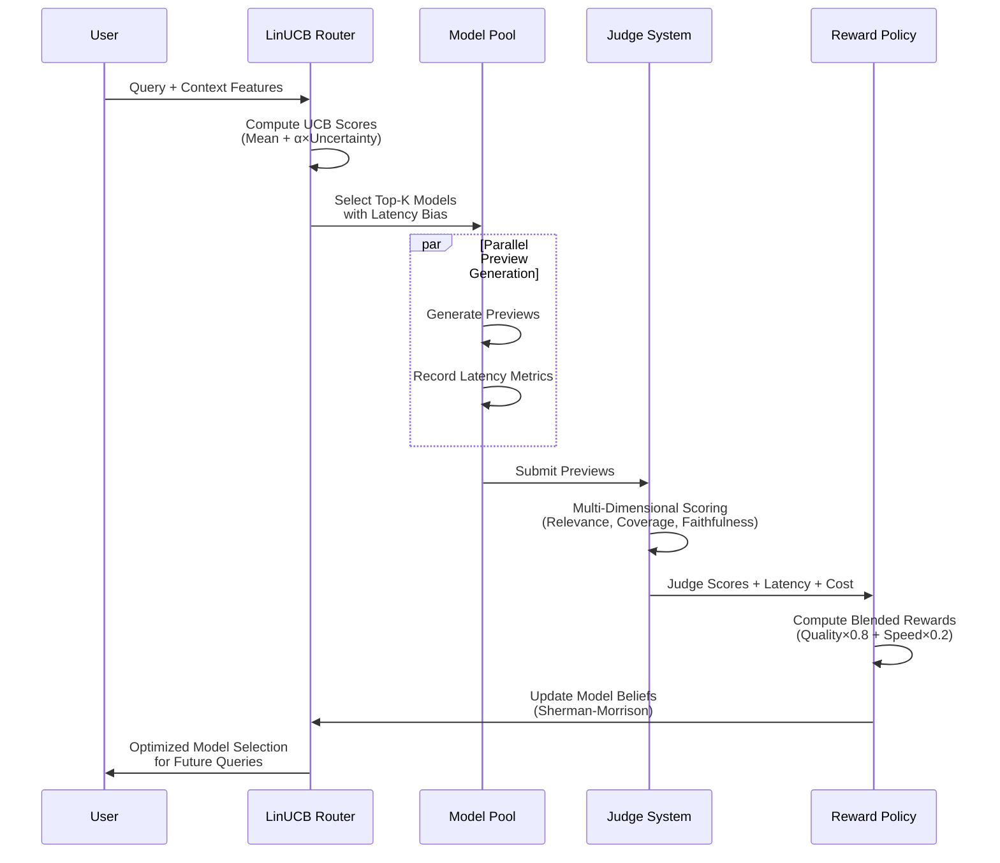

## Parallel AI Research System

A competitive multi-agent system that races multiple frontier models in parallel, using intelligent bandit routing to optimize for quality, latency, and cost.

## Why Bandit Routing?

Traditional static routing wastes resources by treating all models equally. Our LinUCB bandit system learns which models perform best for different query types, automatically optimizing the exploration-exploitation tradeoff to minimize regret while maximizing research quality.

**Key Benefits**:
- **Adaptive Performance**: Learns from historical outcomes to improve future routing decisions
- **Multi-Objective Optimization**: Balances quality, latency, and cost simultaneously  
- **Uncertainty Quantification**: Uses confidence bounds to explore promising but uncertain options
- **Production Ready**: Handles concept drift, state persistence, and graceful degradation

## System Architecture


## Bandit Routing Flow



## Decision Process


## Algorithm Details

### LinUCB Multi-Armed Bandit

**Mathematical Foundation**:
- **Linear Reward Model**: $\mathbb{E}[r|x,a] = \theta_a^\top x$ per arm $a$
- **UCB Score**: $\mathrm{UCB}(x) = \hat{\theta}^\top x + \alpha \sqrt{x^\top A^{-1} x}$
- **Sherman-Morrison Update**: $(A + xx^\top)^{-1} = A^{-1} - \frac{A^{-1}xx^\top A^{-1}}{1 + x^\top A^{-1}x}$

**Why LinUCB Works**:
- **Exploration-Exploitation Balance**: High uncertainty arms get selected for exploration
- **Contextual Learning**: Different query types learn different optimal models
- **Sublinear Regret**: Cumulative regret grows as $O(\sqrt{T \log T})$ with proper tuning

### Multi-Dimensional Reward Policy

**Reward Composition**: $R = w_q \cdot Q + w_l \cdot L + w_c \cdot C$ where:
- **Quality (Q)**: Judge overall scores [0,1] measuring relevance, coverage, faithfulness
- **Latency (L)**: $1 - \text{latency\_norm}$ with P95-based normalization and query-length scaling
- **Cost (C)**: $1 - \text{cost\_norm}$ using token proxy or USD price tables

**Default Weights**: $w_q=0.8, w_l=0.2, w_c=0.0$ (configurable via CLI)

### Performance Optimizations

- **Adaptive Preview Scaling**: Token limits scale 75%-150% by query complexity
- **Speculative Execution**: Top-2 parallel execution for queries >2000 chars
- **Latency Bias**: P95-based negative bias applied during model selection
- **State Persistence**: Dual Redis + file persistence with version management

### Quickstart (Setup + Run)

1) Install prerequisites

- Python 3.10+
- uv (Python package manager). If needed: `pip install uv`

2) Sync dependencies

```bash
cd parallel_agents
uv sync
```

3) Configure API keys via .env

Create a file named `.env` in this folder with at least your OpenAI key:

```bash
cat > .env << 'EOF'
OPENAI_API_KEY=sk-your-openai-key
# Optional if using a custom endpoint (e.g., Azure/OpenAI-compatible gateway):
# OPENAI_BASE_URL=https://api.openai.com/v1
# OPENAI_ORG_ID=your-org-id
EOF
```

The CLI automatically loads `.env` (via `python-dotenv`).

4) See CLI usage

```bash
uv run parallel-agents --help
```

5) Minimal run

```bash
uv run parallel-agents "What are the key risks and mitigations of LLM hallucinations in production?" \
  --judge-model gpt-4o \
  --agent-models "gpt-4o,gpt-4o-mini" \
  --strategy bandit
```

#### Verify (Tier 1) — default command

After implementing Tier 1, use this command to verify lint, format, and tests:

```bash
cd parallel_agents && uv sync && \
uv run ruff check . && uv run ruff format --check . && uv run pytest -q
```

6) Full bandit example

```bash
uv run parallel-agents "Summarize the latest evidence for outpatient UTI management in CA-ON." \
  --judge-model gpt-4o \
  --agent-models "o4-mini-deep-research-2025-06-26,gpt-4o,gpt-4o-mini,gpt-5,gpt-4.1" \
  --min-preview-tokens 200 \
  --strategy bandit \
  --bandit-alpha 1.5 \
  --bandit-ridge 1e-2 \
  --bandit-state .router_state.json \
  --bandit-length-threshold 2000 \
  --bandit-quality-weight 0.8 \
  --bandit-speed-weight 0.2
```

Notes:
- An entry point is installed as `parallel-agents` (via `pyproject.toml`). You can also run `uv run python -m src.cli ...`.
- Router state persistence:
  - If `REDIS_URL` is set, router state persists in Redis under `ROUTER_STATE_KEY` (default: `router_state`).
  - If `--bandit-state` points to a file, JSON persistence is also used (for portability). Delete it to reset local learning.

### Optional: Redis preview cache

You can enable a lightweight Redis cache for preview responses to reduce cost and latency on repeat queries.

1) Run Redis locally (or use a managed instance):

```bash
brew install redis
brew services start redis
# or docker run -p 6379:6379 redis:7
```

2) Add the following to your `.env`:

```bash
REDIS_URL=redis://localhost:6379/0
# Optional TTL (seconds) for preview cache entries (default: 600)
PREVIEW_CACHE_TTL=600
```

When `REDIS_URL` is set, the orchestrator will:
- Attempt to read previews from Redis before calling models
- Write preview results into Redis with a TTL after generation
- Fall back to direct generation if the cache is disabled or a miss occurs

Implementation: see `src/services/cache_redis.py` and usage in `src/race/race.py`.

## Why Bandit Routing Works

**Core Problem**: Judge determines quality after seeing all previews, but we must choose which model to run first for the full answer. Without learning, this choice is arbitrary.

**Bandit Solution**: Learn the mapping from query context → "which model tends to win judging and succeed" to reduce retries and tail latency.

**Measurable Benefits**:
- **First-try success rate ↑**: UCB policy increases probability that first attempt matches judge preference
- **Retries per run ↓**: Fewer fallbacks reduce E2E p95/p99 latency  
- **Cost ↓**: Reduced retry tokens and bounded exploration via α/λ parameters
- **Drift resilience**: Online updates adapt to provider quality/latency changes

**When Bandit Helps Most**: Model performance varies by query characteristics (length/intent/risk) and provider health drifts over time.

**When Bandit Won't Help**: Homogeneous models with identical performance across contexts (converges to baseline with minimal overhead).


## Configuration

**Core Environment Variables**:
- `OPENAI_API_KEY`, `REDIS_URL`, `ROUTER_STATE_KEY`
- `BANDIT_ALPHA`, `BANDIT_RIDGE`, `BANDIT_QUALITY_WEIGHT`, `BANDIT_SPEED_WEIGHT`
- `PREVIEW_CACHE_TTL`, `MODEL_PRICE_USD_PER_TOKEN_JSON`

**Key CLI Flags**:
- `--strategy {baseline,bandit}`: Switch routing strategies
- `--bandit-alpha`: Exploration strength (higher = more exploration)
- `--bandit-ridge`: Regularization for stability
- `--bandit-quality-weight --bandit-speed-weight`: Reward composition weights
