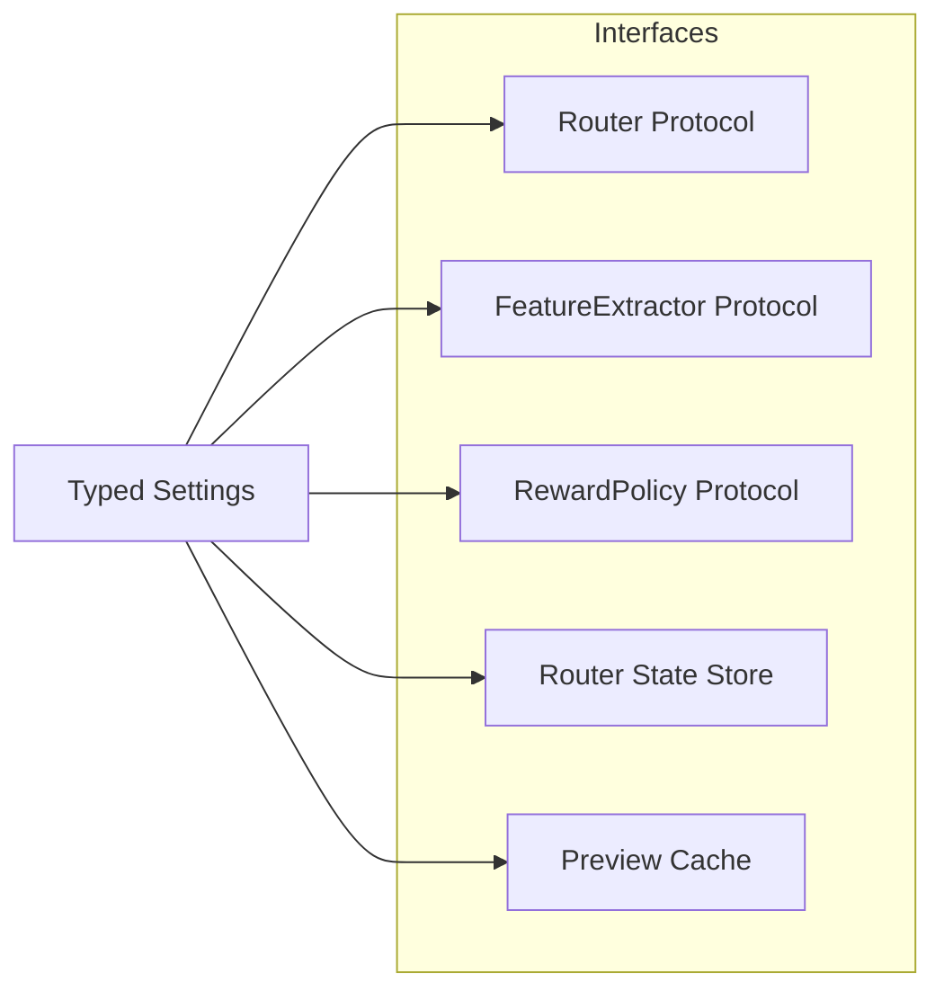
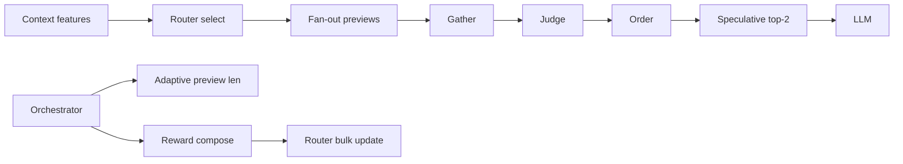
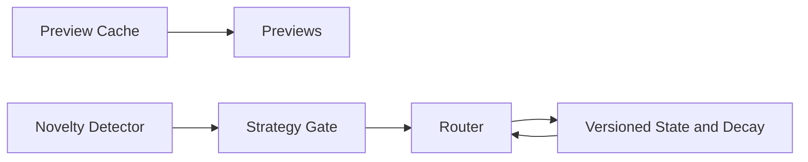
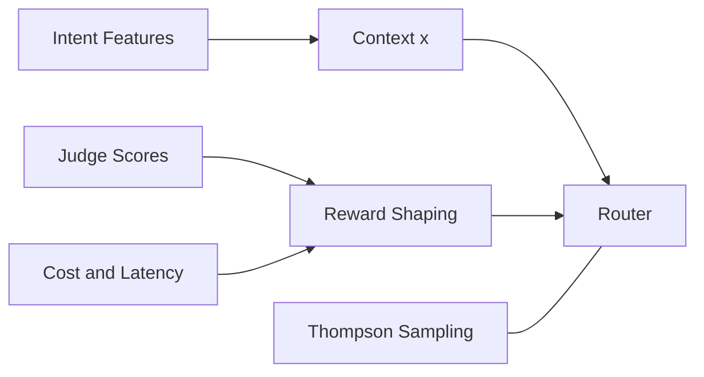
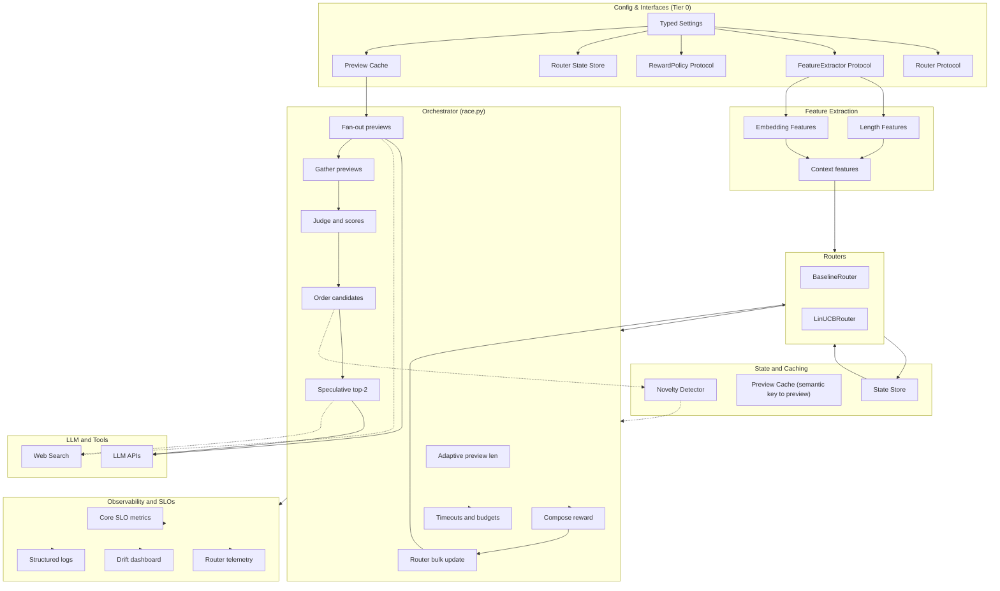

## Parallel Agents: High-Impact Roadmap (Plug-and-Play, Throughput, Latency, Cost)

### Status & Priorities
- Status: Tier 0 planned, Tier 1 not started, Tier 2/3 backlog.
- Next up (in order):
  1) Bandit Quality (NOW): Reward shaping (quality/latency/cost), capture preview latency, OpenAI embedding features with projection, router state versioning/decay, router telemetry (OpenTelemetry + Prometheus), CLI flags for weights/features.
  2) Tier 0: Router/Feature/Reward/State/Cache interfaces + typed settings + retries/timeouts/budgets.
  3) Tier 1: Adaptive preview length; latency feature; fallback penalty; speculative top-2 full stage.
  4) Tier 2: Error/guardrail features; cold-start priors; failure classification; preview cache.
  5) Tier 3: Reward shaping; intent-aware features; learned fallback ordering; Thompson Sampling baseline.

### Bandit Quality — NOW (focused priorities)
- Reward policy: formalize `reward = clamp01(wq*quality + wl*latency_norm + wc*cost_norm)` using judge overall for quality, per-model p95 preview latency for latency_norm, and token-cost proxy or price table for cost_norm. Add CLI flags `--bandit-quality-weight --bandit-latency-weight --bandit-cost-weight`.
- Latency capture: measure per-preview elapsed seconds in streaming; set `PreviewOutcome.latency_s` and export a histogram per model; compute rolling p95 for normalization.
- Embedding features: use OpenAI `text-embedding-3-small` by default; project 1536→(16–32) dims with a fixed random projection; z-score/min-max normalize; gate via `--bandit-features=(length|embedding)`.
- Router state: persist `{version, d}`; reset/migrate on mismatch; implement `decay(factor)` to forget stale history.
- Telemetry: integrate OpenTelemetry (OTLP) for traces and `prometheus_client` for metrics; log router inputs (x), chosen arm, mean, uncertainty, and realized reward.
- Defaults: keep `LengthFeatures` as baseline; make embedding path optional to avoid extra deps/latency when disabled.

### Tier 0 — Plug-and-play foundations (APIs, reliability, portability)
- Router interface: define `Router` protocol with `select(context, arms, k)` and `bulk_update(context, rewards)`; have `BaselineRouter` and `LinUCBRouter` implement it. Choose via config.
- FeatureExtractor interface: `FeatureExtractor.compute(query) -> list[float]`. Ship `LengthFeatures` (no extra deps) and `EmbeddingFeatures` (optional small encoder).
- RewardPolicy interface: pluggable `compose(preview_stats, judge_scores, costs) -> reward∈[0,1]`. Default `QualityLatencyCostPolicy` with clamps and CLI weights.
- State store abstraction: `RouterStateStore` (file, SQLite, or Redis). Persist `{version, d, arms, counters}`. Reset/migrate on mismatch.
- PreviewCache interface: optional semantic cache; default in-memory LRU; adapters for disk/Redis.
- Config & settings: single typed settings (pydantic) merging CLI, env, and optional YAML; versioned schema.
- Timeouts & cancellation: enforce per-phase timeouts; cancel speculative/losing tasks cleanly; no task leakage.
- Unified retry/backoff: central policy for preview/judge/full with sane defaults; observable retries.
- Budgets & guardrails: max tokens per phase, cost ceiling per run, fail-fast on breach.
- Observability: tracing via OpenTelemetry (OTLP exporter) and metrics via `prometheus_client` (histograms/counters); structured logs; zero hard dependency on external services.
- Contract tests: for `Router`, `FeatureExtractor`, `RewardPolicy`, `StateStore`, `PreviewCache` to guarantee plugin compatibility.

#### Diagram (Tier 0)

### Tier 1 — Immediate impact (latency ↓, throughput ↑)
- Adaptive preview length: scale `min_preview_tokens` by query size/complexity.
- Latency-aware context: add recent per-model p95 latency to bandit features (normalized by query size).
- Penalize fallbacks in reward: add small penalty per fallback to boost first-try success.
- Partial parallelism in full stage: speculative top-2 for long queries; cancel loser on clear winner.

#### Diagram (Tier 1)

### Tier 2 — Cost and stability (cost ↓, reliability ↑)
- Error/guardrail signals in context: include recent error rate and hallucination risk indicators.
- Cold-start priors: initialize per-model priors from offline evals to reduce early exploration waste.
- Failure classification: separate transient API errors vs content failures; route away from unstable.
- Caching previews: memoize for repeated/similar queries; reuse across strategies for A/B.

#### Diagram (Tier 2)

### Tier 3 — Learning quality (routing accuracy ↑)
- Reward shaping: blend judge overall with speed, latency, token efficiency, and stability score.
- Intent-aware features: add high-level intent (reasoning, coding, retrieval-heavy) to the context.
- Multi-winner fallback learning: learn an optimal fallback ordering from historical judge scores.
- Thompson Sampling baseline: benchmark LinTS vs LinUCB for uncertainty handling.

#### Diagram (Tier 3)

### Observability & SLOs (make improvements measurable)
- Core SLOs: first-try success rate, retries per run, E2E p50/p95/p99, tokens per phase, $/resolved.
- Router telemetry: log context x, chosen arm, predicted mean/uncertainty, realized reward; export via OpenTelemetry traces and Prometheus metrics (optional wandb export).
- Drift dashboard: per-arm traffic share, regret (offline), health signals, and exploration rate over time.

### Testing & evaluation
- Offline replay harness: feed recorded runs, compute oracle, estimate regret and routing accuracy.
- Property tests: reward ∈ [0,1], router state remains stable/invertible across updates.
- Benchmarks: compare baseline vs bandit vs LinTS on curated prompt suites; report significance.

### Prioritization rationale
- Tier 1 items directly reduce tail latency and retries with minimal complexity.
- Tier 2 addresses cost and stability—critical for production viability and user trust.
- Tier 3 improves long-term routing quality and adaptivity, after foundational SLOs stabilize.

---

## Known weaknesses and mitigation plan

### 1) Toy features (bias/length/word count)
- Mitigation (Tier 1-2):
  - Add semantic embeddings feature to context. Use OpenAI `text-embedding-3-small`; reduce to 16–32 dims via a fixed random projection to keep `d` small.
  - Normalize features (z-score or min-max) and document the feature schema.
  - Wire via `feature_extractor` default in `race.py` so it’s pluggable.
- Implementation notes:
  - New `src/features.py`: `compute_context_features(query, length_threshold)` returning `[1.0, length_norm, word_norm, emb_1..emb_k]` (embeddings via OpenAI + projection when enabled).
  - Update `LinUCBRouter(d=k+3)` and set `--bandit-length-threshold` appropriately.

### 2) Reward design is shaky (judge vs speed)
- Mitigation (Tier 2):
  - Use normalized judge overall as primary signal. Add optional latency (normalized by per-model p95 from metrics) and cost-per-token terms; clip to [0,1].
  - Make weights explicit via CLI (`--bandit-quality-weight --bandit-latency-weight --bandit-cost-weight`).
  - Add unit tests for monotonicity and bounds.
- Implementation notes:
  - Update reward in `race.py` to: `reward = wq*judge + wl*latency_norm + wc*cost_norm` then clamp.
  - Log per-term contributions for observability; compute latency_norm using preview latency histograms; cost_norm using tokens×price (or tokens proxy until a price table is added).

### 3) Judge already ensures correctness (bandit only affects order)
- Mitigation (Tier 1):
  - Hybrid gate: if previews are cheap and fallback rate < threshold, skip bandit; else enable.
  - Or use bandit only to order full-run attempts (not preview order) to reduce retries.
- Implementation notes:
  - Add `--bandit-auto` mode in `cli.py`; gate inside `race.py` using recent fallback rate metric.

### 4) Persistence issues when feature schema changes
- Mitigation (Tier 1):
  - Version router state with `feature_version` and `d`. On mismatch, reset or migrate.
  - Add decay/sliding window to forget stale history.
- Implementation notes:
  - Update `routing_linucb._save/_load` to persist `{version, d}`. On load mismatch, re-init.
  - Add `router.decay(factor)` to scale `A_inv`/`b` periodically.

### 5) Dynamic arm pool (drop chronic losers)
- Mitigation (Tier 2):
  - Track `trials` and `wins` per arm. Deactivate arms below win-rate and trial thresholds.
  - Allow manual reactivation via config.
- Implementation notes:
  - Extend router state with counters; add `prune(min_trials, min_win_rate)` and `deactivate_arm(arm)`.

### 6) Hybrid strategy for rare/unique queries
- Mitigation (Tier 2):
  - Novelty detector: compare current embedding to cache; if novel, explore/baseline; if familiar, bandit.
  - Cache previews by semantic key to reuse across runs.
- Implementation notes:
  - Add `semantic_cache` module (FAISS/annoy or in-memory cosine) keyed by embedding; store minimal preview.
  - Gate strategy in `race.py` based on nearest-neighbor distance and frequency.

### Concrete file touchpoints
- `src/features.py` (new): query embeddings + feature vector construction.
- `src/routing_linucb.py`: state versioning, decay, prune/deactivate, counters; keep `bulk_update`.
- `src/race.py`: plug new `feature_extractor`, capture preview latency, updated reward blend, hybrid gate, logging.
- `src/runtime/streaming.py`: measure and return preview elapsed seconds; set `PreviewOutcome.latency_s`.
- `src/cli.py`: new flags for weights, auto-gate, feature version.
- `tests/`: add tests for version mismatch reset, reward bounds/monotonicity, prune behavior, hybrid gate.

## Architecture Diagram

 

