## Async Agent Patterns for LLM Systems (with Mermaid diagrams)

- **Reference**: [OpenAI Agents – agent patterns](https://github.com/openai/openai-agents-python/tree/main/examples/agent_patterns)
- **Goal**: Provide drop‑in, async-first building blocks that complement deep research and iterative research SDK agents: guardrails, routing, hedging, verification, memory, and budgeting.

---

## Overview: Plan → Parallel Evidence → Synthesize → Verify → Refine

- **Where these patterns fit**: before planning (guardrails), during tool/model selection (router, hedging), in evidence gathering (parallel fetch/verify), during synthesis (self‑consistency early‑stop), and after output (post‑guardrail verification).

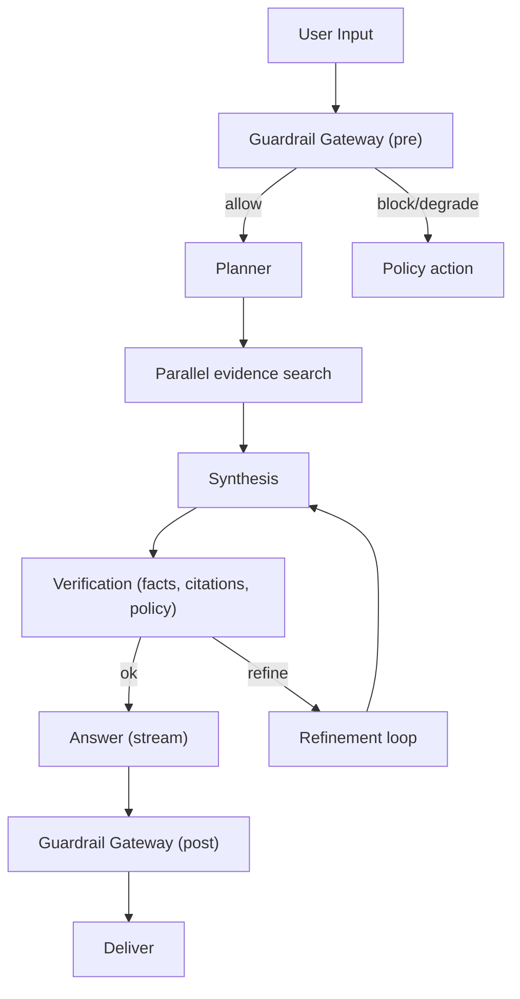

Additional evaluation loop for offline→online quality management:

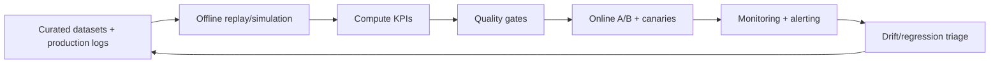

---

## Pattern 1: Guardrail Gateway (Parallel Validation + Unified Policy)

- **What**: Run PII, jailbreak, toxicity, prompt‑injection, and length checks concurrently, merge into a single decision: allow, redact, block, degrade model.
- **Why**: A reusable boundary around agents/tools that is easy to extend and measure.
- **When**: Pre‑planner and post‑answer; optionally around tool I/O.

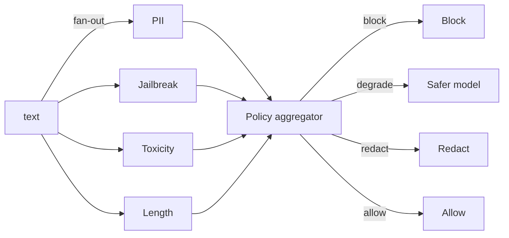

Key design points:
- **Hard‑fail short‑circuit**: immediate block on critical failures.
- **Timeouts**: any validator that times out is treated as failure (configurable).
- **Extensibility**: validators implement a simple async interface; add/remove without touching the aggregator.

Success metrics (KPIs):
- Policy violation recall (high‑severity) ≥ 0.95; false block ≤ 3%.
- Added p95 latency ≤ 40 ms (local) / ≤ 150 ms (remote API).
- Validator timeout rate ≤ 0.5%; incident rate after post‑guardrail → 0.

Evaluation:
- Labeled adversarial corpora; offline replay of prod prompts; shadow‑mode trials.
- Threshold calibration per locale/domain; track action mix drift.

Domain use cases:
- Legal: redact privileged/PII; block confidential exhibit egress.
- SEC: block MNPI leakage; require sources for company claims.
- Healthcare: PHI detection; prevent unsafe medication guidance.
- Chatbots: toxicity, prompt‑injection, length/attachment caps.

Metrics table:

| Metric | Definition | Target |
| --- | --- | --- |
| High‑severity recall | Fraction of disallowed high‑risk content correctly blocked | ≥ 0.95 |
| False block rate | Benign content incorrectly blocked | ≤ 1–3% |
| Added latency p95 | Guardrail overhead at p95 | ≤ 40–150 ms |
| Timeout rate | Validators exceeding timeout | ≤ 0.5% |
| Post‑incident rate | Incidents after post‑guard | → 0 |

Evaluation criteria:

| Check | Method | Gate |
| --- | --- | --- |
| Adversarial robustness | Red‑team set replay, prompt‑injection suites | No regressions vs last release |
| PHI/PII detection | Labeled corpora across locales | Recall ≥ threshold |
| Policy calibration | Threshold sweep + precision/recall curves | Pick Pareto knee |
| Shadow trial | Action mix vs control | Within ±5% expected mix |

References:
- [OWASP Top 10 for LLM Applications](https://owasp.org/www-project-top-10-for-large-language-model-applications/)
- [OpenAI Moderation API](https://platform.openai.com/docs/guides/moderation/overview)
- [HIPAA De‑identification (18 identifiers)](https://www.hhs.gov/hipaa/for-professionals/privacy/special-topics/de-identification/index.html)

---

## Pattern 2: Async Model/Provider Router (Contextual + Bandit)

- **What**: Route a request across multiple models/providers using features (domain, length, guardrail risk) and multi‑armed bandit signals (latency, cost, quality).
- **Why**: Reduce cost/latency while maintaining quality; graceful degradation.

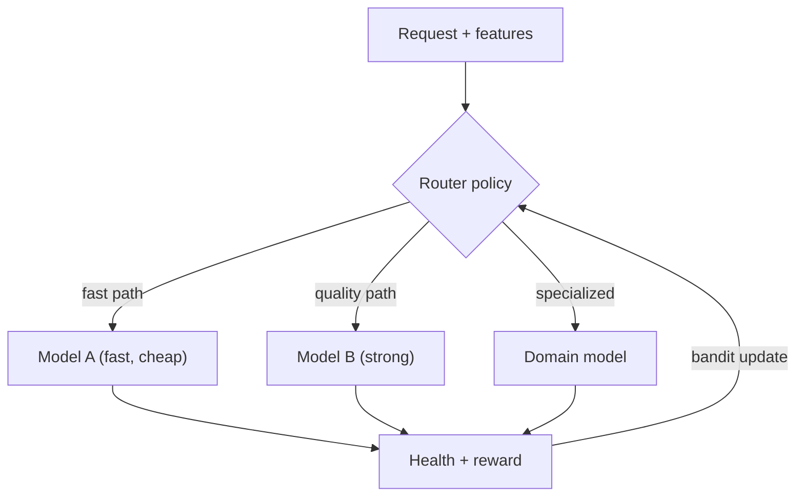

Implementation considerations:
- **Health**: rolling success rate, p95 latency, error budget.
- **Reward**: auto‑judging, click feedback, A/B buckets.
- **Exploration**: epsilon‑greedy or Thompson sampling with budget caps.

Success metrics (KPIs):
- Cost per resolved request ↓ vs single strong baseline; p95 latency ↓.
- Regret vs oracle (auto‑judge) small; correct route rate ≥ 90%.
- Fallback activation rate and provider error budget burn within SLO.

Evaluation:
- Offline counterfactual scoring across all models; bandit simulations.
- Online stratified A/B; per‑domain monitoring.

Domain use cases:
- Legal/SEC: strong model for complex reasoning; fast model for boilerplate.
- Healthcare: safety‑tuned models for clinical; general for admin.
- Chatbots: cost‑aware routing by intent/length/guardrail risk.

Metrics table:

| Metric | Definition | Target |
| --- | --- | --- |
| Routing accuracy | Match to oracle/best model per request | ≥ 90% |
| Oracle regret | Quality delta vs best possible choice | Small, stable |
| Cost per request | Total $ per resolved request | ↓ vs baseline |
| Latency p95/p99 | End‑to‑end latency tails | Within SLO |
| Fallback rate | Share of degraded or retried routes | Stable, low |

Evaluation criteria:

| Check | Method | Gate |
| --- | --- | --- |
| Counterfactual routing | Score requests across all models | Regret within band |
| Bandit stability | Simulation with historical lat/err | No oscillations |
| Provider health | Error budget burn | < SLO budget |

References:
- [The Tail at Scale](https://research.google/pubs/pub40801/) (hedging, health, tail mitigation)
- [Thompson Sampling Tutorial (Russo et al.)](https://web.stanford.edu/~bvr/pubs/TS_Tutorial.pdf)

---

## Pattern 3: Self‑Consistency Early‑Stop (Parallel Sampling + Voting)

- **What**: Fan out N samples in parallel; stop when K agree via a cheap vote/judge to cut cost and tail latency.
- **Why**: High‑quality outputs with adaptive spend.

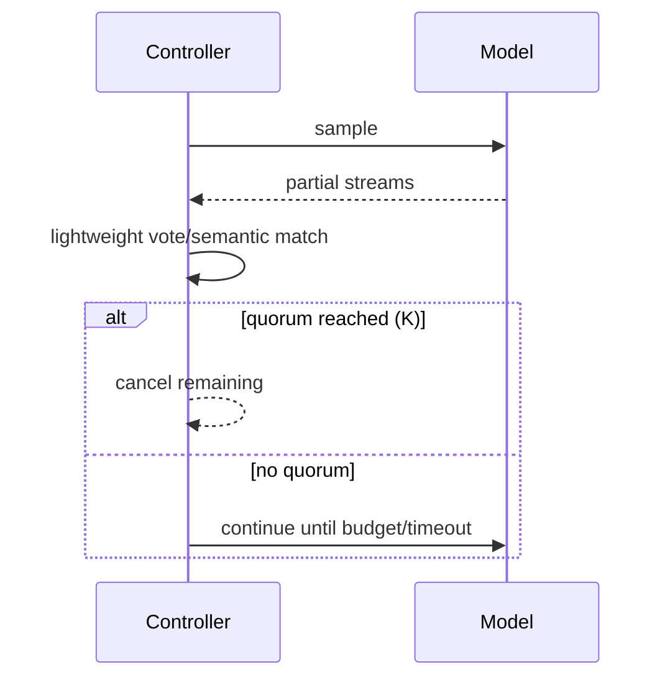

Notes:
- Use streaming tokens for early semantic vote windows.
- Cancel inflight completions on quorum to save tokens.

Success metrics (KPIs):
- Token spend saved 20–60% vs fixed‑N; p95 latency reduction.
- Win rate vs single sample improves; cancel success ≥ 95%.

Evaluation:
- Calibrate K‑of‑N by task; accuracy‑vs‑spend curves; streaming early‑vote tests.

Domain use cases:
- Legal/SEC: section QA on filings; claim extraction by majority.
- Healthcare: guideline answers with consensus threshold.
- Chatbots: reduce tail latency while maintaining consistency.

Metrics table:

| Metric | Definition | Target |
| --- | --- | --- |
| Spend saved | Tokens saved vs fixed‑N sampling | 20–60% |
| Latency saved | Time saved vs fixed‑N | Material p95 drop |
| Accuracy lift | Win rate vs single sample | +X% task‑dependent |
| Cancel success | Fraction of surplus tasks canceled | ≥ 95% |

Evaluation criteria:

| Check | Method | Gate |
| --- | --- | --- |
| K‑of‑N calibration | Accuracy–spend frontier | Choose Pareto knee |
| Early‑vote fidelity | Streaming partial vote vs final | Correlation ≥ target |

References:
- [Self‑Consistency Improves Chain of Thought (Wang et al., 2022)](https://arxiv.org/abs/2203.11171)

---

## Pattern 4: Async Citation Verifier (Evidence Coverage)

- **What**: For answers with citations, fetch all sources concurrently, fuzzy‑match spans, compute coverage and strength; trigger auto‑repair if below thresholds.

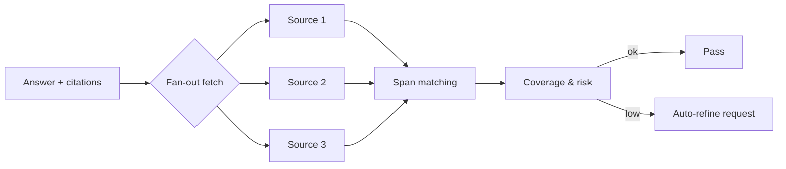

Practical tips:
- Cache HTTP responses; normalize HTML/PDF; use robust snippet windows.
- Penalize citations that never resolve; surface provenance in telemetry.

Success metrics (KPIs):
- Supported‑claim coverage ≥ 0.9; unsupported claim rate ≤ 2%.
- Citation resolution success ≥ 99%; verification p95 ≤ 800 ms.

Evaluation:
- Span labeling + entailment checks; crawl stability; weekly human audits.

Domain use cases:
- Legal: link claims to statutes/cases; flag unsupported assertions.
- SEC: tie to specific 10‑K/10‑Q items/footnotes.
- Healthcare: cite guidelines/drug labels; flag stale sources.
- Chatbots: verified news links; block unverifiable claims.

Metrics table:

| Metric | Definition | Target |
| --- | --- | --- |
| Coverage | Share of claims supported by sources | ≥ 0.9 |
| Unsupported rate | Claims without support | ≤ 1–2% |
| Resolution success | Sources fetched/parsed successfully | ≥ 99% |
| Overhead p95 | Added verification latency | ≤ 0.8 s |
| Repair success | Refinements that fix support gaps | ≥ 60% |

Evaluation criteria:

| Check | Method | Gate |
| --- | --- | --- |
| Span support | Fuzzy match + entailment scoring | Above threshold |
| Crawl stability | Stress test redirects/soft‑404s | Pass |
| Provenance | Telemetry completeness | 100% cited items |

References:
- [RAGAS: Retrieval‑Augmented Generation Evaluation](https://docs.ragas.io/)
- [SEC EDGAR API Documentation](https://www.sec.gov/edgar/sec-api-documentation)

---

## Pattern 5: Speculative Streaming (Draft + Strong Reconciliation)

- **What**: Stream from a fast draft model immediately while a stronger model runs; reconcile when the strong output arrives.
- **Why**: Perceived latency win with quality floor.

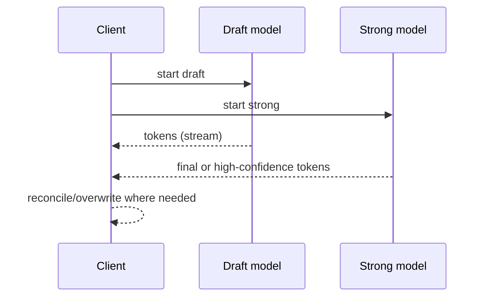

Considerations:
- Token alignment boundaries; do not overwrite mid‑sentence.
- Fall back to draft if strong times out.

Success metrics (KPIs):
- TTFB ↓ significantly; TTL near strong model; visible rewrites ≤ 10%.

Evaluation:
- Measure TTFB/TTL; reconciliation diffs at sentence boundaries; UX surveys.

Domain use cases:
- Legal/SEC: instant scaffolds refined by strong pass.
- Healthcare: clinician UX improvements with final safety check.
- Chatbots: responsiveness for long answers.

Metrics table:

| Metric | Definition | Target |
| --- | --- | --- |
| TTFB | Time to first byte to user | Strongly ↓ vs strong‑only |
| TTL | Time to last token | Near strong baseline |
| Rewrite rate | Visible overwrite/correction proportion | ≤ 10% |

Evaluation criteria:

| Check | Method | Gate |
| --- | --- | --- |
| Reconciliation safety | Sentence‑boundary overwrite only | Enforced |
| Fallback behavior | Strong timeout handling | Draft acceptable |

References:
- [Draft & Verify: Lossless LLM Acceleration via Self‑Speculative Decoding (2023)](https://arxiv.org/abs/2309.08168)
- [Medusa: Inference Acceleration with Multi‑Head Decoding (2023)](https://arxiv.org/abs/2304.08466)

---

## Pattern 6: Tool Hedging and Quorum

- **What**: Invoke redundant tools/providers in parallel (e.g., search, geocoding, news). Accept first passing validation or require quorum.

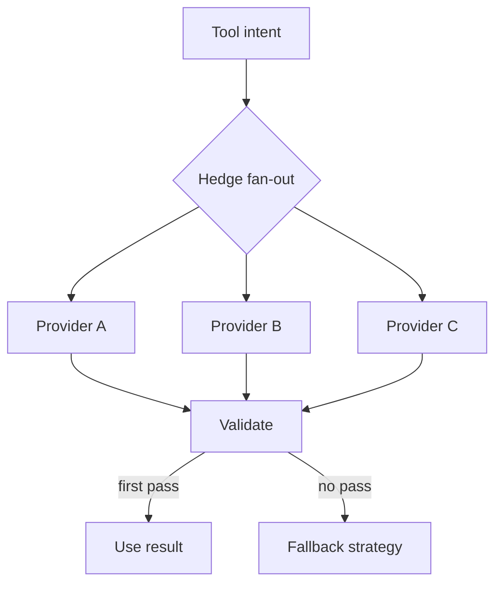

Guidelines:
- Bound concurrency; apply per‑provider budgets and circuit breakers.
- Normalize schemas; attach provenance for downstream audits.

Success metrics (KPIs):
- Task success ↑; p95 latency ↓ vs worst provider; waste bounded.
- Quorum satisfaction rate meets target.

Evaluation:
- Chaos tests with timeouts/errors; hedge delay Δ tuning; schema/provenance tests.

Domain use cases:
- Legal/SEC: multi‑search, EDGAR mirrors, entity resolvers.
- Healthcare: redundant drug interaction/formulary APIs.
- Chatbots: web search/geocoding/weather hedging.

Metrics table:

| Metric | Definition | Target |
| --- | --- | --- |
| Success rate | Task success under provider faults | ↑ vs single |
| p95 latency | Hedged latency vs worst provider | ↓ |
| Waste ratio | Canceled losing calls / total | Bounded |
| Quorum rate | Fraction meeting quorum | ≥ target |

Evaluation criteria:

| Check | Method | Gate |
| --- | --- | --- |
| Hedge delay tuning | Optimize Δ vs latency distribution | On Pareto front |
| Correlation analysis | Provider latency/error correlation | Low/moderate |

References:
- [The Tail at Scale](https://research.google/pubs/pub40801/)
- [SEC EDGAR API Documentation](https://www.sec.gov/edgar/sec-api-documentation)

---

## Pattern 7: Policy‑Aware Planner Gating

- **What**: Run guardrails on plans/tool‑calls before execution; block unsafe actions; degrade capabilities instead of hard failure.

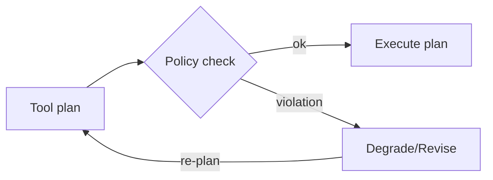

Notes:
- Validate arguments (URLs, shell commands) with allowlists.
- Explain degradations to users for trust.

Success metrics (KPIs):
- Unsafe plan block recall high on seeded cases; low false blocks.
- Degraded‑plan success high vs full block.

Evaluation:
- Synthetic unsafe plans; allow/deny unit tests; decision log reviews.

Domain use cases:
- Legal/SEC: forbid external uploads; constrain scraping.
- Healthcare: block ePHI egress; restrict to vetted medical sources.
- Chatbots: sandbox filesystem/network commands.

Metrics table:

| Metric | Definition | Target |
| --- | --- | --- |
| Unsafe plan recall | Block unsafe plans in test suite | High (≥ target) |
| False block | Safe plans incorrectly blocked | Low |
| Degraded success | Success rate after capability degrade | High |

Evaluation criteria:

| Check | Method | Gate |
| --- | --- | --- |
| Argument allowlist | URL/command validation | Enforced |
| Decision logging | Justification completeness | 100% |

References:
- [OWASP Top 10 for LLM Applications](https://owasp.org/www-project-top-10-for-large-language-model-applications/)

---

## Pattern 8: Async Memory Retriever Merge

- **What**: Query multiple memory backends in parallel (vector, keyword, graph), de‑dup and score‑normalize before synthesis.

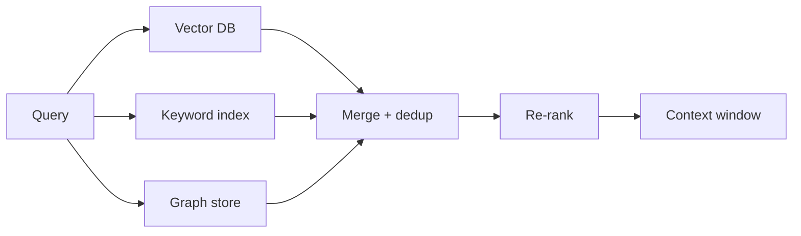

Tips:
- Use stable chunk IDs to de‑dup across sources.
- Apply reciprocal rank fusion or learned re‑rankers.

Success metrics (KPIs):
- Recall@k/nDCG ↑ vs single backend; cross‑source dedup high.
- Added p95 latency ≤ 300 ms; context hit ratio above threshold.

Evaluation:
- Gold relevant chunks; ablations across backends/re‑rankers; chunk ID stability.

Domain use cases:
- Legal: cases/statutes/memos across vector/keyword/graph.
- SEC: filings + news + transcripts fused retrieval.
- Healthcare: chart notes + guidelines + formularies.
- Chatbots: help center + forums + docs.

Metrics table:

| Metric | Definition | Target |
| --- | --- | --- |
| Recall@k / nDCG | Retrieval effectiveness | ↑ vs single backend |
| Cross‑source dedup | Duplicate reduction across sources | High |
| Added p95 latency | Merge/re‑rank overhead | ≤ 300 ms |
| Context hit ratio | Retrieved context used in answer | ≥ threshold |

Evaluation criteria:

| Check | Method | Gate |
| --- | --- | --- |
| Fusion quality | RRF vs learned re‑ranker | Pick winner |
| Stable IDs | Chunk ID consistency across indexes | Stable |

References:
- [Reciprocal Rank Fusion (Cormack & Clarke, 2009)](https://dl.acm.org/doi/10.1145/1571941.1572114)

---

## Pattern 9: Adaptive Budget Router (Tokens, Time, Dollars)

- **What**: Dynamically allocate budgets across steps based on uncertainty and remaining limits.

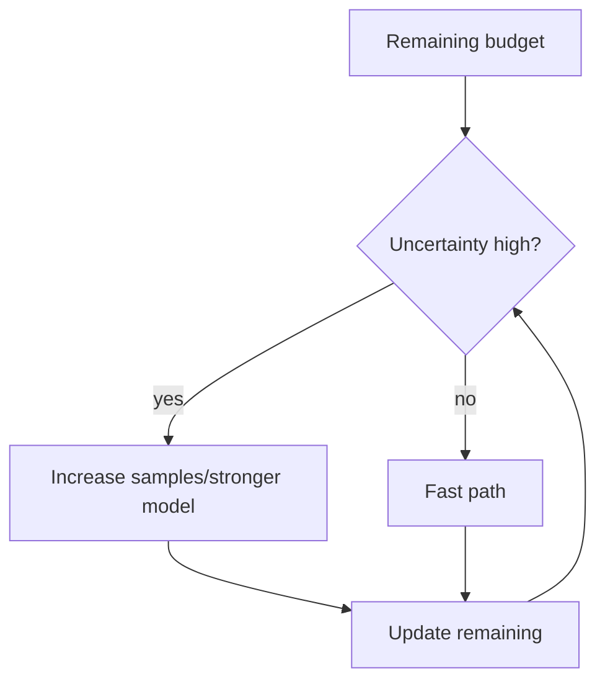

Heuristics:
- Confidence from self‑consistency, citation coverage, or judge scores.
- Stop conditions: max spend, max latency, minimum quality.

Success metrics (KPIs):
- Budget adherence within bounds; efficient quality‑spend frontier; tail latency SLO.

Evaluation:
- Simulate uncertainty‑driven spend; policy curves; online escalation tracking.

Domain use cases:
- Legal/SEC: spend more on ambiguous claims; fast path for boilerplate.
- Healthcare: increase spend for high‑uncertainty clinical answers.
- Chatbots: user‑tiered budgets; dynamic sampling on ambiguity.

Metrics table:

| Metric | Definition | Target |
| --- | --- | --- |
| Budget adherence | Share of requests within token/$/time caps | ≥ 99% |
| Quality frontier | Accuracy vs spend efficiency | On Pareto |
| Tail latency | p95/p99 under budget control | Within SLO |

Evaluation criteria:

| Check | Method | Gate |
| --- | --- | --- |
| Control law | Simulated uncertainty‑driven spend | Stable |
| Gates | Min quality vs max spend | Satisfied |

References:
- [Thompson Sampling Tutorial (Russo et al.)](https://web.stanford.edu/~bvr/pubs/TS_Tutorial.pdf)

---

## Pattern 10: Hedged Requests with Timeouts

- **What**: Launch a primary request; after a small hedge delay, launch a backup; take the first successful response.

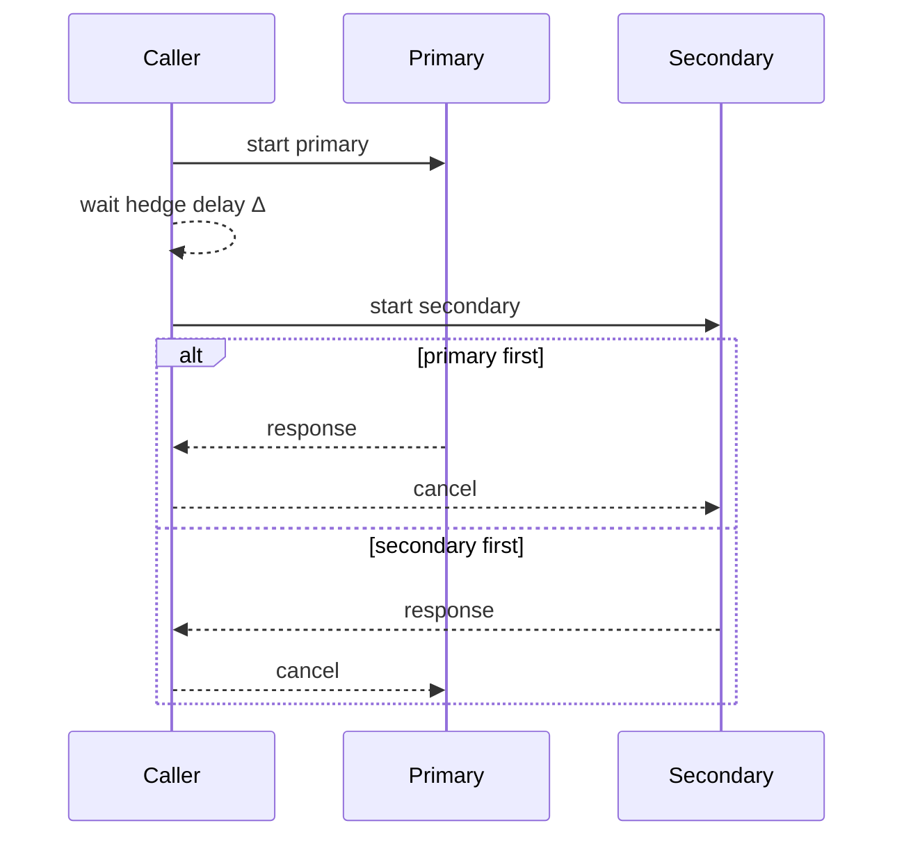

Best practices:
- Tune Δ based on p50 latency to reduce wasted work.
- Combine with circuit breakers and provider health.

Success metrics (KPIs):
- p95 latency reduction; duplicate overhead within bounds; cancel rate ≥ 90%.

Evaluation:
- Optimize hedge delay Δ vs latency/correlation; fault injection (timeouts, 5xx).

Domain use cases:
- Legal/SEC: EDGAR/API fetches across mirrors/providers.
- Healthcare: variable‑SLO medical APIs.
- Chatbots: web fetch, RAG retrievers, translation.

Metrics table:

| Metric | Definition | Target |
| --- | --- | --- |
| p95 reduction | Latency vs single call | Material ↓ |
| Duplicate overhead | Extra cost of hedge | Within policy |
| Cancel success | Losing hedge canceled | ≥ 90% |
| Success under faults | Pass rate with injected failures | ↑ |

Evaluation criteria:

| Check | Method | Gate |
| --- | --- | --- |
| Δ tuning | Optimize hedge delay | On Pareto front |
| Fault injection | Timeouts/5xx/jitter | Resilient |

References:
- [The Tail at Scale](https://research.google/pubs/pub40801/)

---

## Integration with OpenAI Deep/Iterative Research SDK Agents

These patterns slot into the agent lifecycle from the OpenAI examples:
- **Guardrails**: `pre_input` and `post_output` validation hooks around the agent call.
- **Router/Bandit**: model/provider selection inside your agent factory before invoking the agent run.
- **Parallel evidence + verification**: wrap tool runners with hedging/quorum and citation verification.
- **Self‑consistency**: multi‑sample wrapper on the agent’s `respond` with early stopping.
- **Adaptive budget**: middleware tracking tokens/time across steps.

Implementation sketch (Python, async pseudo‑code):

```python
async def run_agent(request):
    decision = await guardrail_gateway.validate_input(request.prompt)
    if decision.action == "block":
        return policy_block(decision)

    model = await router.select_model(request, decision)

    with budget_tracker as budget:
        result = await self_consistent_runner(
            lambda: agent.respond(model=model, request=request, budget=budget),
            quorum=2, max_parallel=4, timeout_s=15,
        )

    verified = await citation_verifier.verify(result)
    if not verified.ok:
        result = await refinement_loop(result, verified.missing)

    post = await guardrail_gateway.validate_output(result.text)
    return enforce(post, result)
```

---

## Operational Guidance

- **Timeouts & cancellation**: always wrap awaits with timeouts; cancel downstream tasks on quorum/fail.
- **Metrics**: log latency, cost, reward, and policy outcomes per pattern; add trace spans.
- **Budget safety**: hard caps for tokens and parallelism; per‑provider limits.
- **Testing**: simulate slow/failing providers; fuzz invalid tool arguments; unit‑test aggregator logic.

---


## References

- [OpenAI Agents – agent patterns](https://github.com/openai/openai-agents-python/tree/main/examples/agent_patterns)
